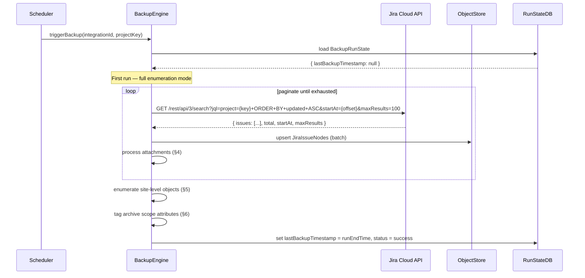
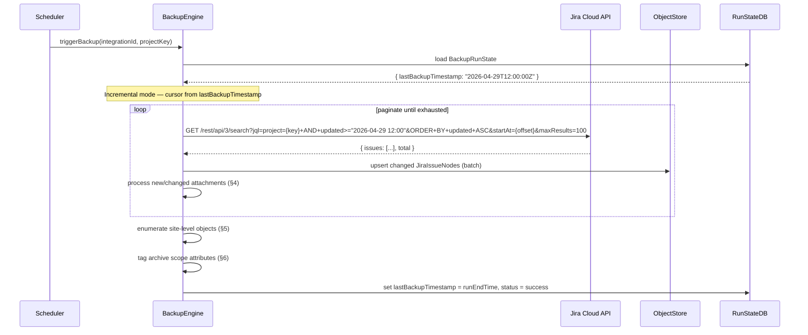
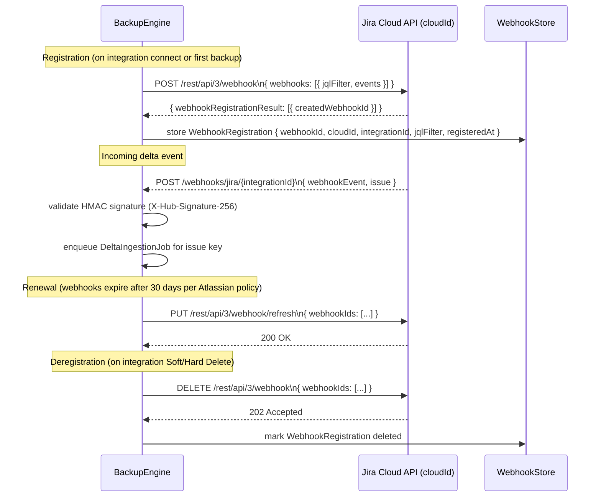
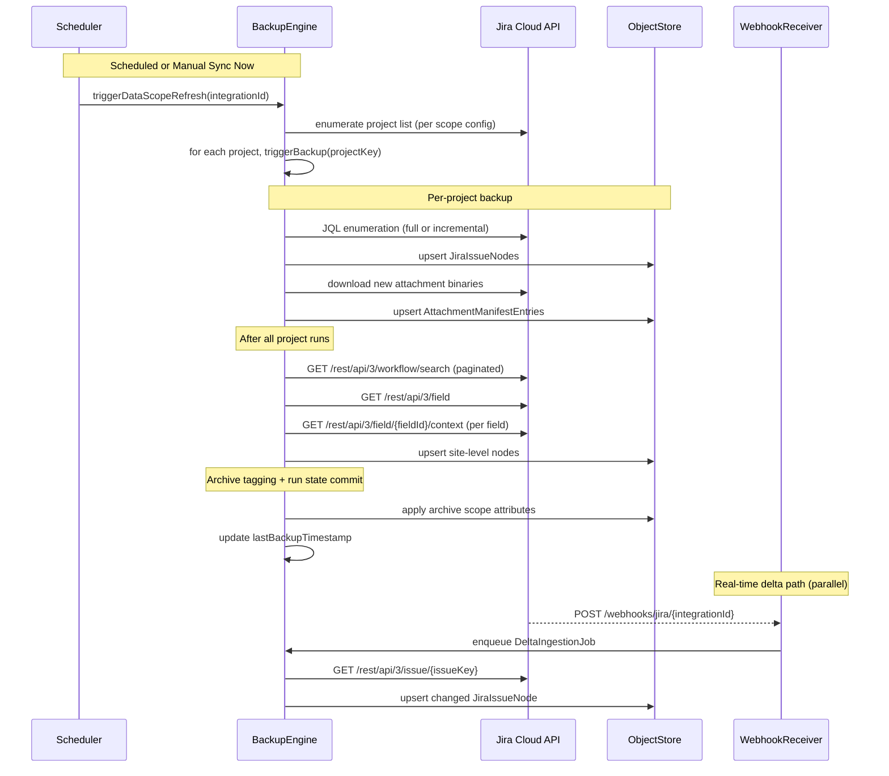

# Backup Discovery and Data Ingestion Pipeline Architecture

## Overview

This document defines the architecture for the full Jira object discovery and backup pipeline, covering:
- Full JQL enumeration (first run) and incremental JQL cursor (subsequent runs)
- Dynamic webhook registration for real-time deltas
- Attachment binary materialisation with deduplication
- Site-level shared object enumeration
- Archive scope attribute tagging
- Purge cascade boundary enforcement
- SLA Domain defaults and Data Scope refresh configuration

---

## 1. Data Flow: Full vs Incremental Backup Runs

### 1.1 Run State: `lastBackupTimestamp` Persistence

Each project-level backup context stores a `lastBackupTimestamp` (ISO 8601 UTC). This value is:
- `null` on first run → triggers **Full JQL Enumeration**
- Set to the end-of-run wall-clock after each successful run → triggers **Incremental JQL Cursor** on next run

**Storage model:**

```
BackupRunState {
  id:                   UUID          NOT NULL PK
  integrationId:        UUID          NOT NULL FK → OAuthConnection.id
  cloudId:              string        NOT NULL
  projectKey:           string        NOT NULL
  lastBackupTimestamp:  datetime|null NULLABLE  -- null = never backed up
  lastRunStatus:        enum(success, failed, in_progress)
  lastRunCompletedAt:   datetime|null NULLABLE
}
```

`lastBackupTimestamp` is only updated (committed) after a run fully completes without fatal error. Partial runs leave it unchanged so the next run retries from the same cursor.

---

### 1.2 Full JQL Enumeration (First Run)

Triggered when `lastBackupTimestamp IS NULL`.



**JQL:** `project={projectKey} ORDER BY updated ASC`
**Pagination:** `startAt` cursor, `maxResults=100` per page, stop when `startAt + maxResults >= total`.

---

### 1.3 Incremental JQL Cursor (Subsequent Runs)

Triggered when `lastBackupTimestamp IS NOT NULL`.



**JQL:** `project={projectKey} AND updated >= "{lastBackupTimestamp formatted as YYYY-MM-DD HH:mm}" ORDER BY updated ASC`

**Timestamp format note:** Jira JQL `updated` comparisons accept `"YYYY-MM-DD HH:mm"` format. The engine converts `lastBackupTimestamp` from ISO 8601 to this format before constructing the JQL string.

**Overlap buffer:** The engine subtracts a 60-second overlap buffer from `lastBackupTimestamp` when building the JQL cursor to guard against clock skew between the backup service and Jira Cloud. Duplicate upserts are idempotent.

---

## 2. Dynamic Webhook Registration

### 2.1 Scope Requirement

Webhook registration requires the `manage:jira-webhook` OAuth scope. If this scope is absent in the validated scope set, webhook registration is skipped and a non-blocking banner is shown.

### 2.2 Webhook Lifecycle



### 2.3 Registered Events

| Event | Trigger |
|---|---|
| `issue_created` | New issue in any watched project |
| `issue_updated` | Any field change on an existing issue |
| `issue_deleted` | Issue deleted from Jira |

### 2.4 JQL Filter for Webhooks

```
project in ({comma-separated projectKeys for this integration})
```

Scoped per integration. If the integration covers all projects, the filter is omitted (Atlassian supports empty filter = all projects).

### 2.5 Idempotency Strategy

Before registering, the engine queries:
```
GET /rest/api/3/webhook
```
and checks `WebhookStore` for an existing `WebhookRegistration` with matching `cloudId + integrationId`. If one exists and is not expired, registration is skipped. This prevents duplicate webhook registrations on retries or service restarts.

**Expiry tracking:** Atlassian webhooks expire 30 days after last refresh. The engine stores `expiresAt = registeredAt + 30 days` and schedules a renewal job at `expiresAt - 48h`.

### 2.6 WebhookRegistration Data Model

```
WebhookRegistration {
  id:             UUID      NOT NULL PK
  integrationId:  UUID      NOT NULL FK → OAuthConnection.id
  cloudId:        string    NOT NULL
  webhookId:      integer   NOT NULL  -- Jira-assigned ID
  jqlFilter:      string    NULLABLE
  events:         string[]  NOT NULL  -- ["issue_created","issue_updated","issue_deleted"]
  registeredAt:   datetime  NOT NULL
  expiresAt:      datetime  NOT NULL  -- registeredAt + 30 days
  deletedAt:      datetime  NULLABLE  -- soft-delete marker
}
```

---

## 3. Attachment Binary Materialisation and Deduplication

### 3.1 Strategy

Attachments are deduplicated by `attachmentId` (Jira's stable attachment identifier). On each backup run, the engine compares discovered attachment IDs against the manifest. Only new IDs trigger a binary download; unchanged IDs are carried forward via sidecar reference only.

### 3.2 Attachment Manifest Schema

```
AttachmentManifestEntry {
  id:               UUID      NOT NULL PK
  backupPointId:    UUID      NOT NULL FK → BackupPoint.id
  attachmentId:     string    NOT NULL  -- Jira attachment ID (stable across versions)
  issueKey:         string    NOT NULL
  filename:         string    NOT NULL
  mimeType:         string    NULLABLE
  sizeBytes:        integer   NULLABLE
  binaryStorageRef: string    NULLABLE  -- path/key in object storage (null if sidecarOnly=true)
  sidecarOnly:      boolean   NOT NULL DEFAULT false
                                        -- true = binary not re-downloaded; carried from prior BackupPoint
  priorManifestEntryId: UUID  NULLABLE  -- FK → AttachmentManifestEntry.id of prior entry (if sidecarOnly)
  downloadedAt:     datetime  NULLABLE
  checksum:         string    NULLABLE  -- SHA-256 hex of binary (populated on download)
}
```

**Field notes:**
- `binaryStorageRef`: storage key (e.g., S3 object key or blob path). `null` when `sidecarOnly=true`.
- `sidecarOnly=true`: the binary already exists in a prior backup point; this entry points to it via `priorManifestEntryId`.
- `checksum`: populated only on actual download, used to detect binary corruption on restore.

### 3.3 Deduplication Algorithm

```
for each issue in backup run:
  for each attachment in issue.fields.attachment:
    existing = query AttachmentManifestEntry
                 where attachmentId = attachment.id
                   and backupPointId in (prior successful backupPoints for this integration)
                 order by downloadedAt DESC limit 1

    if existing IS NOT NULL:
      insert AttachmentManifestEntry {
        sidecarOnly: true,
        binaryStorageRef: null,
        priorManifestEntryId: existing.id,
        ...metadata fields...
      }
    else:
      binary = GET /rest/api/3/attachment/content/{attachment.id}
      storageRef = upload(binary)
      insert AttachmentManifestEntry {
        sidecarOnly: false,
        binaryStorageRef: storageRef,
        checksum: sha256(binary),
        ...metadata fields...
      }
```

---

## 4. Site-Level Shared Object Enumeration

Site-level objects are enumerated **once per backup run per cloudId** (not per project), after all project-level JQL enumeration completes. This ordering ensures project data is consistent before shared objects are snapshotted.

### 4.1 Enumeration Sequence

```
1. JiraWorkflowNode          → GET /rest/api/3/workflow/search
2. JiraCustomFieldDefinitionNode → GET /rest/api/3/field
3. JiraCustomFieldContextNode    → for each field from step 2:
     a. GET /rest/api/3/field/{fieldId}/context
     b. GET /rest/api/3/field/{fieldId}/context/option  (for each contextId)
```

This order is required: CustomFieldContextNode depends on CustomFieldDefinitionNode IDs from step 2.

### 4.2 API Endpoints and Pagination

#### JiraWorkflowNode — `GET /rest/api/3/workflow/search`

| Parameter | Value |
|---|---|
| `startAt` | cursor (0-based) |
| `maxResults` | 50 (Atlassian default/max for this endpoint) |
| Stop condition | `startAt + maxResults >= total` |

Response shape: `{ values: [WorkflowNode], total, startAt, isLast }`
Stop when `isLast === true`.

#### JiraCustomFieldDefinitionNode — `GET /rest/api/3/field`

This endpoint returns **all fields** in a single response (no pagination). The response is an array of field objects. Upsert all into `JiraCustomFieldDefinitionNode`.

#### JiraCustomFieldContextNode — `GET /rest/api/3/field/{fieldId}/context`

| Parameter | Value |
|---|---|
| `startAt` | cursor |
| `maxResults` | 50 |
| Stop condition | `isLast === true` |

For each context returned, enumerate options:

#### JiraCustomFieldContextNode options — `GET /rest/api/3/field/{fieldId}/context/option`

| Parameter | Value |
|---|---|
| `contextId` | from parent context |
| `startAt` | cursor |
| `maxResults` | 100 |
| Stop condition | `isLast === true` |

Only applicable to `select`, `multiselect`, `radiobutton`, `checkboxes` field types. The engine checks `field.schema.type` before issuing option enumeration calls.

### 4.3 Concurrency

Workflow enumeration (step 1) and CustomFieldDefinition enumeration (step 2) run concurrently. CustomFieldContextNode enumeration (step 3) is gated on step 2 completion. Context option sub-requests within step 3 run concurrently with a max concurrency of 5 to avoid Atlassian rate limiting.

---

## 5. Archive Scope Attribute Tagging Strategy

Archive scope attributes are applied as metadata tags on backup objects at ingest time. They do not modify the source Jira objects; they annotate the backup node for downstream purge and restore logic.

### 5.1 Attribute Definitions

| Node Type | Attribute | Source Field | Value Condition | Applied When |
|---|---|---|---|---|
| `JiraProjectNode` | `archived` | `project.archived` | `true` | Project is marked archived in Jira |
| `JiraIssueNode` | `statusCategory` | `issue.fields.status.statusCategory.key` | `"done"` | Issue status maps to "Done" category |
| `JiraSprintNode` | `state` | `sprint.state` | `"closed"` | Sprint state is closed |

### 5.2 Tagging Implementation

Tags are stored as indexed fields on each node type (not in a generic tag table) to allow efficient filtering at restore/purge query time.

```
JiraProjectNode.archivedFlag:    boolean  NOT NULL DEFAULT false
JiraIssueNode.statusCategory:    string   NULLABLE  -- "todo"|"in_progress"|"done"|"undefined"
JiraSprintNode.state:            string   NULLABLE  -- "active"|"closed"|"future"
```

**Sprint note:** Sprint data is only ingested when the `read:board-scope:jira-software` scope is present. When absent (graceful degradation mode from Sprint 1 contract), `JiraSprintNode` rows are not created and the `state=closed` tagging is inapplicable.

### 5.3 Tagging at Ingest

The engine applies tags as part of the upsert operation — no separate tagging pass is required. The source field values are extracted from the Jira API response and mapped directly to the node fields during the JSON-to-node transformation step.

---

## 6. Purge Cascade Exclusion List

### 6.1 Rationale

Site-level shared objects (`JiraWorkflowNode`, `JiraCustomFieldDefinitionNode`, `JiraCustomFieldContextNode`) are referenced by multiple projects and backup points. Including them in a project-scoped purge cascade would silently corrupt backup data for other projects. The platform layer enforces exclusion at the cascade boundary.

### 6.2 Formally Excluded Node Types

| Node Type | Exclusion Reason |
|---|---|
| `JiraWorkflowNode` | Site-scoped; shared across all projects in the cloudId |
| `JiraCustomFieldDefinitionNode` | Site-scoped; shared across all projects in the cloudId |
| `JiraCustomFieldContextNode` | Child of CustomFieldDefinitionNode; inherits site-scope exclusion |

### 6.3 Platform-Layer Enforcement

The purge cascade engine maintains a static `PURGE_EXCLUDED_NODE_TYPES` set at the platform layer:

```
PURGE_EXCLUDED_NODE_TYPES = {
  "JiraWorkflowNode",
  "JiraCustomFieldDefinitionNode",
  "JiraCustomFieldContextNode"
}
```

When a purge job is constructed for a backup point, the cascade graph traversal skips any edge that leads to a node whose type is in `PURGE_EXCLUDED_NODE_TYPES`. This check is enforced in the cascade builder, not in individual deletion handlers, so it cannot be bypassed by higher-level code.

### 6.4 Lifecycle of Excluded Nodes

Excluded nodes are purged only when the **entire integration (cloudId)** is hard-deleted, which removes all backup points and then removes the site-level shared nodes as a final step. This is distinct from project-scoped or backup-point-scoped purges.

---

## 7. SLA Domain Defaults and Policy Model

### 7.1 Default SLA Domain

| Attribute | Default Value |
|---|---|
| RPO (Recovery Point Objective) | 24 hours |
| Retention | 365 days |
| Policy Model | Configuration A |
| Secondary Copy | Enabled |
| Archive Copy | Enabled |

### 7.2 Configuration A Policy Model

Configuration A defines a two-tier copy topology:

| Tier | Purpose | Retention |
|---|---|---|
| Primary | Fast-restore operational copy | Per RPO cadence; stored in hot-tier storage |
| Secondary/Archive | Long-term retention copy | Up to `retention` days; moved to archive-tier storage after 30 days |

**Secondary Copy:** An exact replica of the primary backup, stored in a geographically separate location. Used for failover and compliance purposes.

**Archive Copy:** A compressed, deduplicated snapshot stored in cold/archive-tier storage. Created from the Secondary Copy at day 30 post-backup. Eligible for restore but with higher latency.

### 7.3 SLADomain Data Model

```
SLADomain {
  id:              UUID      NOT NULL PK
  integrationId:   UUID      NOT NULL FK → OAuthConnection.id
  name:            string    NOT NULL DEFAULT "Default"
  rpoHours:        integer   NOT NULL DEFAULT 24
  retentionDays:   integer   NOT NULL DEFAULT 365
  policyModel:     enum      NOT NULL DEFAULT "configuration_a"
                             -- values: "configuration_a"
  secondaryCopy:   boolean   NOT NULL DEFAULT true
  archiveCopy:     boolean   NOT NULL DEFAULT true
  createdAt:       datetime  NOT NULL
  updatedAt:       datetime  NOT NULL
}
```

---

## 8. Data Scope Refresh

### 8.1 Default Refresh Interval

The Data Scope refresh interval defaults to **24 hours**. This controls how frequently the backup engine re-enumerates the set of projects within the integration scope (to detect newly created or deleted projects) and triggers incremental backup runs.

### 8.2 Refresh Schedule Model

```
DataScopeRefreshConfig {
  id:                  UUID      NOT NULL PK
  integrationId:       UUID      NOT NULL FK → OAuthConnection.id
  refreshIntervalHours: integer  NOT NULL DEFAULT 24  -- minimum: 1, maximum: 168 (7 days)
  lastRefreshedAt:     datetime  NULLABLE
  nextScheduledAt:     datetime  NULLABLE  -- computed: lastRefreshedAt + refreshIntervalHours
  manualSyncPending:   boolean   NOT NULL DEFAULT false
}
```

### 8.3 Manual Sync Now Trigger

Users can trigger an immediate Data Scope refresh outside the scheduled interval via the UI or API:

**API endpoint:**
```
POST /api/v1/integrations/{integrationId}/sync
```

**Request:** empty body (no parameters required)

**Success response:**
```json
{
  "jobId": "<UUID>",
  "status": "queued",
  "triggeredAt": "<ISO 8601 datetime>"
}
```

**Behaviour:**
1. Sets `manualSyncPending = true` on `DataScopeRefreshConfig`.
2. Enqueues a `DataScopeRefreshJob` with `priority = high` (bypasses the normal schedule queue).
3. On job completion, sets `lastRefreshedAt = now`, `nextScheduledAt = now + refreshIntervalHours`, `manualSyncPending = false`.
4. A manual sync does **not** reset the scheduled timer — the next scheduled run fires at the original `nextScheduledAt`.

**Concurrency guard:** If a refresh job is already `in_progress` for this integration, the `POST /sync` endpoint returns `202 Accepted` with the existing `jobId` rather than enqueuing a duplicate.

---

## 9. End-to-End Pipeline Summary



---

## Appendix A: API Endpoints Reference

| Object | Method | Path | Notes |
|---|---|---|---|
| Issue search | GET | `/rest/api/3/search` | JQL param, startAt, maxResults |
| Attachment binary | GET | `/rest/api/3/attachment/content/{id}` | Returns binary stream |
| Webhook registration | POST | `/rest/api/3/webhook` | Requires `manage:jira-webhook` |
| Webhook list | GET | `/rest/api/3/webhook` | For idempotency check |
| Webhook refresh | PUT | `/rest/api/3/webhook/refresh` | Renew before 30-day expiry |
| Webhook delete | DELETE | `/rest/api/3/webhook` | On integration deletion |
| Workflow search | GET | `/rest/api/3/workflow/search` | Paginated, `isLast` stop condition |
| Field list | GET | `/rest/api/3/field` | Returns all fields in single response |
| Field contexts | GET | `/rest/api/3/field/{fieldId}/context` | Paginated |
| Context options | GET | `/rest/api/3/field/{fieldId}/context/option` | Paginated, per contextId |
| Issue (single) | GET | `/rest/api/3/issue/{issueKey}` | Used by webhook delta ingestion |

---

## Appendix B: Decision Log

| Decision | Rationale |
|---|---|
| 60-second overlap buffer on incremental cursor | Guards against sub-minute clock skew between backup service and Jira Cloud; upserts are idempotent so duplicate processing is safe |
| `lastBackupTimestamp` only updated on full success | Prevents silent data gaps from partial runs; next run always retries from last known-good timestamp |
| Site-level enumeration after per-project JQL | Ensures project data consistency before snapshotting shared definitions |
| `PURGE_EXCLUDED_NODE_TYPES` enforced at cascade builder level | Prevents bypass by higher-level code; single authoritative enforcement point |
| Webhook expiry renewal at 48h before expiry | 48h window provides two daily scheduler cycles to retry in case of transient failure |
| Manual Sync Now does not reset the schedule timer | Avoids a scenario where frequent manual triggers prevent scheduled runs from ever firing |
| Attachment deduplication by `attachmentId` (not checksum) | Jira `attachmentId` is stable and available without downloading the binary; checksum computed post-download for integrity validation only |
