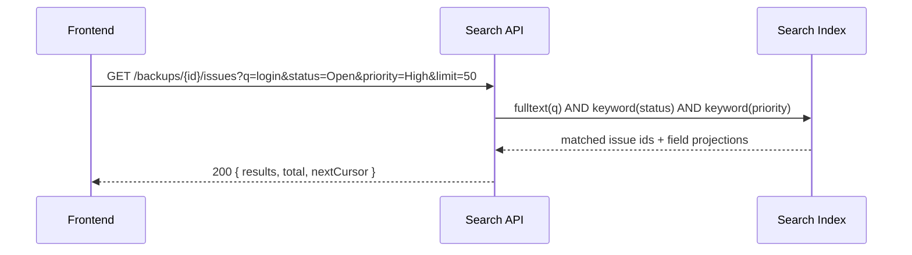
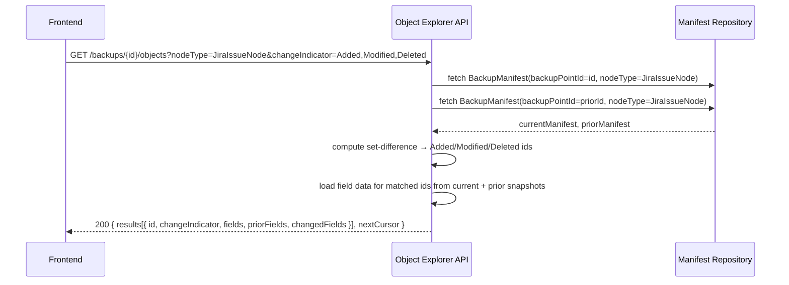
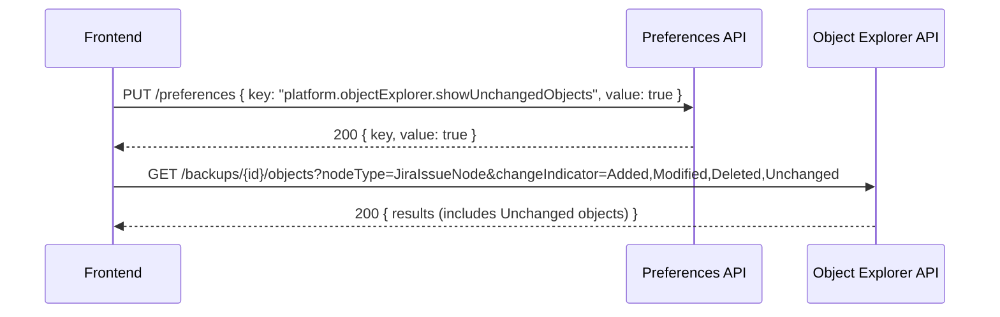

# Browse, Search, and Object Explorer Architecture

**Sprint 3 — Browse, Search, and Object Explorer**
**Author:** software_architect
**Date:** 2026-04-30
**Status:** Approved

---

## 1. Overview

This document defines the search index strategy, query model, API contract, and Object Explorer diff model for all six search surfaces introduced in Sprint 3.

### 1.1 Search Surfaces

| Surface | Scope | Key Filter Axes |
|---|---|---|
| Global Search | All connected sites | name, key, nodeType |
| Project Inventory Search | All projects in a backup | name (tokenised), key (prefix/exact), projectTypeKey, archived |
| Issue Search | Issues within a backup point | summary (tokenised), key, + 11 structured predicates |
| Attachment Search | Attachments within a backup point | filename (tokenised/prefix), mimeType, created range |
| Board/Sprint Search | Boards and sprints (requires `read:board-scope:jira-software`) | name (tokenised), sprint state, date range |
| Object Explorer | Objects in a backup point | change indicator (Added/Modified/Deleted/Unchanged) |

---

## 2. Search Index Strategy

### 2.1 Index Types

Three index types are used across all search surfaces:

| Index Type | Behaviour | Used For |
|---|---|---|
| `fulltext` | Lowercase, whitespace-tokenised. Prefix and whole-token matching. | `name`, `summary`, `filename` fields |
| `keyword` | Exact-match, case-insensitive normalisation. Supports prefix queries via LIKE `{value}%`. | `key`, `mimeType`, `projectTypeKey`, enum fields |
| `range` | Stored as ISO-8601 UTC timestamps. Supports `gte`, `lte`, `gt`, `lt` operators. | `created`, `updated`, `resolved`, sprint `startDate`/`endDate` |

### 2.2 Tokenisation Rule

For `fulltext` fields: split on whitespace and punctuation; index each token individually. A query term matches if it is a prefix of any stored token (prefix scan). Multi-token queries are AND-ed.

### 2.3 Pagination Strategy

All list endpoints use **cursor-based pagination**:

```
GET /...?limit=50&cursor=<opaque_token>
```

- `limit`: 1–200, default 50.
- `cursor`: server-issued opaque string encoding the last-seen sort key + id. Absent on first page.
- Response includes `nextCursor` (null when no further pages).
- Sort order is always stable: primary sort field ASC, then `id` ASC as tiebreaker.

---

## 3. API Contract

All endpoints are prefixed with `/api/v1`.

### 3.1 Global Search

Search across `JiraProjectNode`, `JiraWorkflowNode`, and `JiraCustomFieldNode` by name and key across all connected Jira sites.

#### `GET /search/global`

**Request parameters:**

| Parameter | Type | Required | Description |
|---|---|---|---|
| `q` | string | yes | Query string. Matched against `name` (fulltext) and `key` (keyword prefix). Min 1 char. |
| `siteId` | string | no | Filter to a single connected site (cloudId). Omit for all sites. |
| `nodeType` | string | no | One of `JiraProjectNode`, `JiraWorkflowNode`, `JiraCustomFieldNode`. Omit for all. |
| `limit` | integer | no | Page size. Default 50, max 200. |
| `cursor` | string | no | Pagination cursor from previous response. |

**Success response — HTTP 200:**

```json
{
  "results": [
    {
      "id": "string",
      "nodeType": "JiraProjectNode | JiraWorkflowNode | JiraCustomFieldNode",
      "siteId": "string",
      "siteName": "string",
      "key": "string | null",
      "name": "string",
      "matchedOn": "name | key"
    }
  ],
  "total": 142,
  "nextCursor": "string | null"
}
```

**Error codes:**

| Code | HTTP | Condition |
|---|---|---|
| `MISSING_QUERY` | 400 | `q` not provided or empty |
| `INVALID_NODE_TYPE` | 400 | Unrecognised `nodeType` value |
| `SITE_NOT_FOUND` | 404 | `siteId` does not match any connected site |

---

### 3.2 Project Inventory Search

Search projects within a specific backup point.

#### `GET /backups/:backupPointId/projects`

**Request parameters:**

| Parameter | Type | Required | Description |
|---|---|---|---|
| `q` | string | no | Tokenised keyword match on `name`. |
| `key` | string | no | Prefix or exact match on `key` (keyword index). |
| `projectTypeKey` | string | no | Exact match. Values: `software`, `business`, `service_desk`. |
| `archived` | boolean | no | `true` or `false`. Omit for both. |
| `limit` | integer | no | Default 50, max 200. |
| `cursor` | string | no | Pagination cursor. |

**Success response — HTTP 200:**

```json
{
  "results": [
    {
      "id": "string",
      "key": "string",
      "name": "string",
      "projectTypeKey": "software | business | service_desk",
      "archived": false,
      "issueCount": 1204,
      "lastUpdated": "2026-04-28T10:00:00Z"
    }
  ],
  "total": 38,
  "nextCursor": "string | null"
}
```

**Error codes:**

| Code | HTTP | Condition |
|---|---|---|
| `BACKUP_POINT_NOT_FOUND` | 404 | `backupPointId` does not exist |
| `INVALID_ARCHIVED_VALUE` | 400 | `archived` not parseable as boolean |

---

### 3.3 Issue Search

Search issues within a backup point with tokenised text and a structured filter panel.

#### `GET /backups/:backupPointId/issues`

**Request parameters:**

| Parameter | Type | Index Type | Description |
|---|---|---|---|
| `q` | string | fulltext | Tokenised keyword match on `summary` and `key`. |
| `issuetype` | string (multi) | keyword | Comma-separated list. Exact match on issue type name. |
| `status` | string (multi) | keyword | Comma-separated list. Exact match on status name. |
| `statusCategory` | string (multi) | keyword | Comma-separated list. Values: `To Do`, `In Progress`, `Done`. |
| `priority` | string (multi) | keyword | Comma-separated list. Exact match on priority name. |
| `assignee` | string (multi) | keyword | Comma-separated list of accountIds. |
| `reporter` | string (multi) | keyword | Comma-separated list of accountIds. |
| `labels` | string (multi) | keyword | Comma-separated list. Issue must carry ALL specified labels (AND semantics). |
| `created` | range string | range | ISO-8601 interval: `gte:2026-01-01` or `gte:2026-01-01,lte:2026-04-30`. |
| `updated` | range string | range | Same format as `created`. |
| `resolved` | range string | range | Same format as `created`. Null `resolved` excluded when filter present. |
| `projectKey` | string (multi) | keyword | Comma-separated list. Exact match on project key. |
| `limit` | integer | — | Default 50, max 200. |
| `cursor` | string | — | Pagination cursor. |

**Structured Filter Panel — 11 Predicates:**

| # | Field | Index Type | Multi-value | Null behaviour |
|---|---|---|---|---|
| 1 | `issuetype` | keyword | yes (OR) | excluded if filter present |
| 2 | `status` | keyword | yes (OR) | excluded if filter present |
| 3 | `statusCategory` | keyword | yes (OR) | excluded if filter present |
| 4 | `priority` | keyword | yes (OR) | excluded if filter present |
| 5 | `assignee` | keyword | yes (OR) | null assignee matches `assignee=unassigned` sentinel |
| 6 | `reporter` | keyword | yes (OR) | excluded if filter present |
| 7 | `labels` | keyword | yes (AND) | issues with no labels excluded if filter present |
| 8 | `created` | range | no | never null |
| 9 | `updated` | range | no | never null |
| 10 | `resolved` | range | no | issues with null `resolved` excluded when range filter applied |
| 11 | `projectKey` | keyword | yes (OR) | excluded if filter present |

**Success response — HTTP 200:**

```json
{
  "results": [
    {
      "id": "string",
      "key": "string",
      "summary": "string",
      "issuetype": "string",
      "status": "string",
      "statusCategory": "To Do | In Progress | Done",
      "priority": "string | null",
      "assignee": { "accountId": "string", "displayName": "string" } ,
      "reporter": { "accountId": "string", "displayName": "string" },
      "labels": ["string"],
      "created": "2026-01-15T09:00:00Z",
      "updated": "2026-04-20T14:30:00Z",
      "resolved": "2026-04-21T10:00:00Z | null",
      "projectKey": "string"
    }
  ],
  "total": 5820,
  "nextCursor": "string | null"
}
```

**Error codes:**

| Code | HTTP | Condition |
|---|---|---|
| `BACKUP_POINT_NOT_FOUND` | 404 | `backupPointId` does not exist |
| `INVALID_RANGE_FORMAT` | 400 | Range parameter does not match expected format |
| `INVALID_STATUS_CATEGORY` | 400 | `statusCategory` value not in allowed set |

---

### 3.4 Attachment Search

Search attachments within a backup point.

#### `GET /backups/:backupPointId/attachments`

**Request parameters:**

| Parameter | Type | Index Type | Description |
|---|---|---|---|
| `q` | string | fulltext + keyword prefix | Tokenised and prefix match on `filename`. |
| `mimeType` | string (multi) | keyword | Comma-separated list. Exact match (e.g. `image/png,application/pdf`). |
| `created` | range string | range | ISO-8601 interval. Same format as issue search. |
| `issueId` | string | keyword | Filter to attachments belonging to a specific issue. |
| `limit` | integer | — | Default 50, max 200. |
| `cursor` | string | — | Pagination cursor. |

**Success response — HTTP 200:**

```json
{
  "results": [
    {
      "id": "string",
      "filename": "string",
      "mimeType": "string",
      "sizeBytes": 204800,
      "created": "2026-03-10T11:00:00Z",
      "issueId": "string",
      "issueKey": "string",
      "storageKey": "string"
    }
  ],
  "total": 892,
  "nextCursor": "string | null"
}
```

**Error codes:**

| Code | HTTP | Condition |
|---|---|---|
| `BACKUP_POINT_NOT_FOUND` | 404 | `backupPointId` does not exist |
| `INVALID_RANGE_FORMAT` | 400 | Range parameter malformed |

---

### 3.5 Board and Sprint Search

Search boards and sprints. Endpoint is **conditionally available**: requires `read:board-scope:jira-software` scope. If the scope is absent, the endpoint returns `HTTP 403` with code `BOARD_SCOPE_UNAVAILABLE`; the UI suppresses this surface and shows the non-blocking degradation banner (consistent with Sprint 1 graceful degradation contract).

#### `GET /backups/:backupPointId/boards`

**Request parameters:**

| Parameter | Type | Description |
|---|---|---|
| `q` | string | Tokenised match on board `name`. |
| `limit` | integer | Default 50, max 200. |
| `cursor` | string | Pagination cursor. |

**Success response — HTTP 200:**

```json
{
  "results": [
    {
      "id": "string",
      "name": "string",
      "type": "scrum | kanban",
      "projectKey": "string",
      "sprintCount": 12
    }
  ],
  "total": 8,
  "nextCursor": "string | null"
}
```

#### `GET /backups/:backupPointId/sprints`

**Request parameters:**

| Parameter | Type | Index Type | Description |
|---|---|---|---|
| `q` | string | fulltext | Tokenised match on sprint `name`. |
| `state` | string (multi) | keyword | Comma-separated. Values: `active`, `closed`, `future`. |
| `startDate` | range string | range | ISO-8601 interval on sprint `startDate`. |
| `endDate` | range string | range | ISO-8601 interval on sprint `endDate`. |
| `boardId` | string | keyword | Filter to a specific board. |
| `limit` | integer | — | Default 50, max 200. |
| `cursor` | string | — | Pagination cursor. |

**Success response — HTTP 200:**

```json
{
  "results": [
    {
      "id": "string",
      "name": "string",
      "state": "active | closed | future",
      "boardId": "string",
      "startDate": "2026-03-01T00:00:00Z | null",
      "endDate": "2026-03-14T23:59:59Z | null",
      "completeDate": "2026-03-15T08:00:00Z | null",
      "issueCount": 24
    }
  ],
  "total": 45,
  "nextCursor": "string | null"
}
```

**Error codes (both Board and Sprint endpoints):**

| Code | HTTP | Condition |
|---|---|---|
| `BACKUP_POINT_NOT_FOUND` | 404 | `backupPointId` does not exist |
| `BOARD_SCOPE_UNAVAILABLE` | 403 | `read:board-scope:jira-software` absent for the integration |
| `INVALID_SPRINT_STATE` | 400 | Unrecognised `state` value |
| `INVALID_RANGE_FORMAT` | 400 | Range parameter malformed |

---

## 4. Object Explorer Diff Model

### 4.1 Concepts

| Term | Definition |
|---|---|
| **Backup Point** | A complete, point-in-time snapshot of all backed-up objects for an integration. Identified by `backupPointId`. |
| **Manifest** | The ordered list of `{ id, nodeType, contentHash }` tuples present in a backup point. `contentHash` is a SHA-256 of the canonical serialised object. |
| **Current Backup Point** | The backup point the user has navigated to. |
| **Prior Backup Point** | The immediately preceding backup point for the same integration, ordered by `createdAt` ASC. |

### 4.2 Change Indicator Derivation

Change indicators are computed by comparing the **current manifest** against the **prior manifest**:

```
ChangeIndicator = f(currentManifest, priorManifest, objectId, nodeType)
```

| Condition | Indicator |
|---|---|
| `id` present in current, absent in prior | `Added` |
| `id` present in both, `contentHash` differs | `Modified` |
| `id` present in both, `contentHash` identical | `Unchanged` |
| `id` absent in current, present in prior | `Deleted` |

**Edge case — first backup point:** No prior manifest exists. All objects are labelled `Added`.

**Edge case — deleted objects in the current view:** Deleted objects are sourced from the prior manifest (they do not exist in the current manifest). They are included in the Object Explorer response with `changeIndicator: "Deleted"` and the object's last-known field values from the prior backup point.

### 4.3 Object Explorer Data Shape

#### `GET /backups/:backupPointId/objects`

**Request parameters:**

| Parameter | Type | Description |
|---|---|---|
| `nodeType` | string | Required. One of the node types listed in §4.4. |
| `parentId` | string | Optional. Scope to child objects of a parent (e.g. issues under a project). |
| `changeIndicator` | string (multi) | Comma-separated. Values: `Added`, `Modified`, `Deleted`, `Unchanged`. Default: `Added,Modified,Deleted` (Unchanged hidden — see §5). |
| `limit` | integer | Default 50, max 200. |
| `cursor` | string | Pagination cursor. |

**Success response — HTTP 200:**

```json
{
  "backupPointId": "string",
  "priorBackupPointId": "string | null",
  "results": [
    {
      "id": "string",
      "nodeType": "string",
      "changeIndicator": "Added | Modified | Deleted | Unchanged",
      "fields": { },
      "priorFields": { },
      "changedFields": ["string"]
    }
  ],
  "total": 312,
  "nextCursor": "string | null"
}
```

**Field notes:**

- `fields`: Current object field values. For `Deleted` objects, this is the last-known state from the prior backup point.
- `priorFields`: Prior object field values. `null` for `Added` objects and for `Unchanged` objects (to avoid redundant payload). Populated for `Modified` and `Deleted`.
- `changedFields`: Array of field names whose value differs between `priorFields` and `fields`. Empty array for `Added`, `Deleted`, and `Unchanged`.

**Error codes:**

| Code | HTTP | Condition |
|---|---|---|
| `BACKUP_POINT_NOT_FOUND` | 404 | `backupPointId` does not exist |
| `INVALID_NODE_TYPE` | 400 | Unrecognised `nodeType` |
| `INVALID_CHANGE_INDICATOR` | 400 | Unrecognised `changeIndicator` value |

### 4.4 Node Types Supported in Object Explorer

| Node Type | Parent Scope |
|---|---|
| `JiraProjectNode` | None (top-level) |
| `JiraIssueNode` | `projectId` |
| `JiraAttachmentNode` | `issueId` |
| `JiraWorkflowNode` | None (site-level) |
| `JiraCustomFieldDefinitionNode` | None (site-level) |
| `JiraCustomFieldContextNode` | `fieldId` |
| `JiraBoardNode` | `projectId` (optional) |
| `JiraSprintNode` | `boardId` |

### 4.5 Manifest Computation

Manifests are computed and persisted **during backup ingestion** (not at query time):

1. After all objects for a backup run are written, the backup engine computes `contentHash = SHA-256(canonicalise(object))` for each object.
2. A `BackupManifest` record is written: `{ backupPointId, nodeType, entries: [{ id, contentHash }] }`.
3. At query time, the Object Explorer service fetches the current and prior `BackupManifest` records and performs the set-difference computation in-memory (manifests are bounded by the number of objects per backup point).

---

## 5. Unchanged-Objects Toggle

### 5.1 Platform-Level Preference Key

The toggle is stored as a **platform-level user preference** under the key:

```
platform.objectExplorer.showUnchangedObjects
```

| Property | Value |
|---|---|
| Key | `platform.objectExplorer.showUnchangedObjects` |
| Type | boolean |
| Default | `false` (Unchanged objects **hidden** by default) |
| Scope | Per-user, per-integration (not global across integrations) |

### 5.2 Preference API

#### `GET /preferences`

Returns all preferences for the current user.

**Success response — HTTP 200:**

```json
{
  "preferences": {
    "platform.objectExplorer.showUnchangedObjects": false
  }
}
```

#### `PUT /preferences`

**Request body:**

```json
{
  "key": "platform.objectExplorer.showUnchangedObjects",
  "value": true
}
```

**Success response — HTTP 200:**

```json
{
  "key": "platform.objectExplorer.showUnchangedObjects",
  "value": true,
  "updatedAt": "2026-04-30T12:00:00Z"
}
```

**Error codes:**

| Code | HTTP | Condition |
|---|---|---|
| `INVALID_PREFERENCE_KEY` | 400 | Key not in the allowed preference registry |
| `INVALID_PREFERENCE_VALUE` | 400 | Value type mismatch for the key |

### 5.3 Interaction with Object Explorer Endpoint

When `showUnchangedObjects` is `false` (default), the frontend **omits** `Unchanged` from the `changeIndicator` filter parameter when calling `GET /backups/:backupPointId/objects`. The backend does not read the preference directly; the filtering is driven entirely by the `changeIndicator` query parameter.

This keeps the backend stateless with respect to UI display preferences and allows the frontend to override toggle state per-request if needed.

---

## 6. Data Models

### 6.1 BackupManifest

```
BackupManifest {
  id:              string       — UUID, primary key
  backupPointId:   string       — FK to BackupPoint; not null
  nodeType:        string       — one of the node types in §4.4; not null
  entries:         JSON array   — [{ id: string, contentHash: string }]; not null
  computedAt:      timestamp    — UTC; not null
}
```

Composite index on `(backupPointId, nodeType)` for efficient manifest lookup.

### 6.2 UserPreference

```
UserPreference {
  id:           string     — UUID, primary key
  userId:       string     — not null
  integrationId: string    — FK to OAuthConnection; not null
  key:          string     — preference key; not null
  value:        JSON       — preference value; not null
  updatedAt:    timestamp  — UTC; not null
}
```

Unique constraint on `(userId, integrationId, key)`.

---

## 7. Sequence Diagrams

### 7.1 Issue Search with Filter Panel



### 7.2 Object Explorer Diff Computation



### 7.3 Unchanged-Objects Toggle



---

## 8. Key Decisions

1. **Cursor-based pagination** preferred over offset pagination to avoid page-drift as backup data is immutable per backup point.
2. **Manifest stored at ingest time**, not computed on-demand, to bound Object Explorer query latency regardless of object count.
3. **`Deleted` objects sourced from prior manifest** — the current backup point contains only surviving objects; deleted objects are reconstructed from prior snapshot fields.
4. **Unchanged toggle is frontend-driven** (via `changeIndicator` parameter) to keep the backend stateless with respect to display preferences.
5. **Board/Sprint endpoints honour Sprint 1 graceful degradation contract** — `BOARD_SCOPE_UNAVAILABLE` (403) maps to the existing non-blocking banner UI pattern.
6. **`labels` filter uses AND semantics** — an issue must carry all specified labels (OR semantics would produce too many false positives for a multi-label filter).
7. **`assignee=unassigned` sentinel** allows filtering for issues with no assignee, since `null` cannot be passed as a keyword filter value in a query string.
8. **`contentHash` is SHA-256 of canonical JSON** (keys sorted alphabetically, null fields omitted) to ensure hash stability across serialisation differences.
