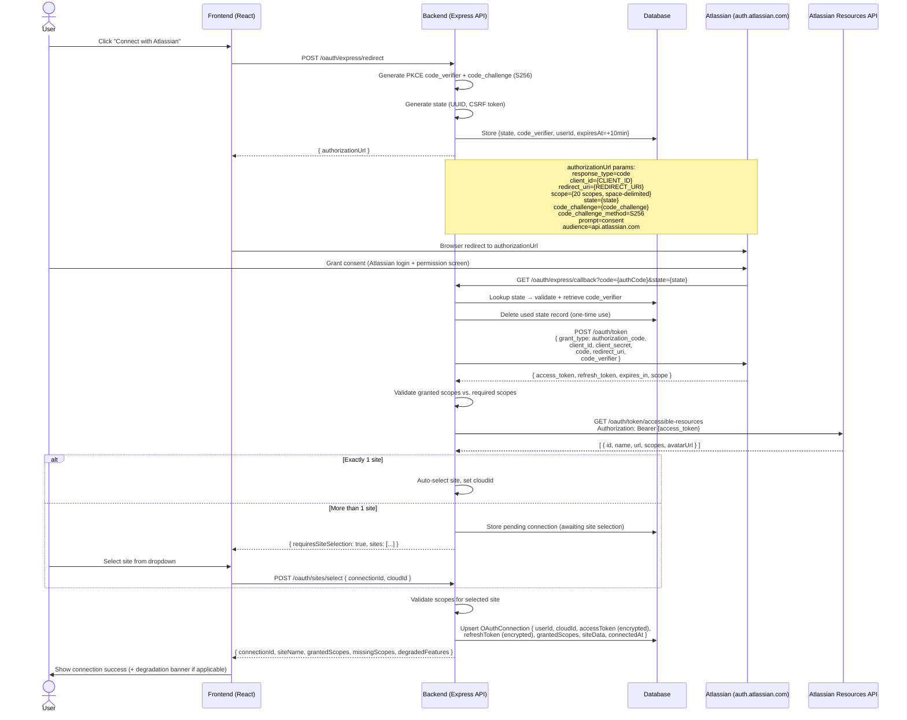
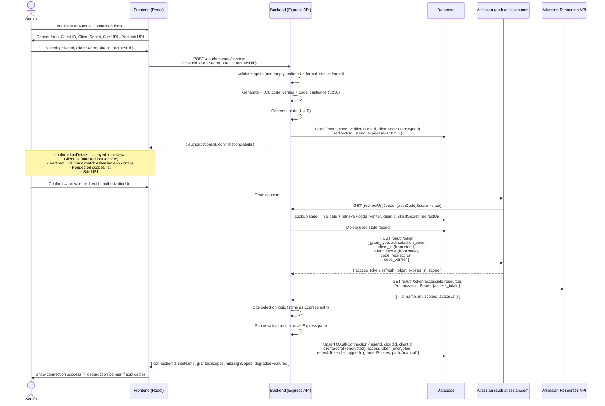

# Atlassian OAuth 2.0 (3LO) Integration Architecture

_Sprint 1 — Authentication and Connection_
_Author: software_architect | Date: 2026-04-30_

---

## Table of Contents

1. [Overview](#1-overview)
2. [Express OAuth Path — Sequence Diagram](#2-express-oauth-path)
3. [Manual OAuth Path — Sequence Diagram](#3-manual-oauth-path)
4. [20-Scope Permission Matrix](#4-20-scope-permission-matrix)
5. [Graceful Degradation Contract](#5-graceful-degradation-contract)
6. [Data Models](#6-data-models)
7. [Backend API Contract](#7-backend-api-contract)
8. [Multi-Site Selection Logic](#8-multi-site-selection-logic)
9. [Refresh Token Expiry Alerting](#9-refresh-token-expiry-alerting)
10. [Integration Lifecycle (Soft/Hard Delete)](#10-integration-lifecycle)

---

## 1. Overview

The integration uses Atlassian's **OAuth 2.0 Authorization Code Grant with PKCE** (3-Legged OAuth, 3LO).  
Two connection paths are supported:

| Path | Description |
|------|-------------|
| **Express** | User clicks "Connect with Atlassian"; our backend generates the authorization URL and handles the callback automatically. |
| **Manual** | Power-user/admin supplies Client ID, Client Secret, Site URL, and Redirect URI. Useful for custom Atlassian app registrations or network-restricted environments. |

Both paths converge at the same token-exchange and cloudId-resolution flow.

**Authorization server:** `https://auth.atlassian.com`  
**Token endpoint:** `https://auth.atlassian.com/oauth/token`  
**Accessible resources:** `https://api.atlassian.com/oauth/token/accessible-resources`  
**API base:** `https://api.atlassian.com/ex/jira/{cloudId}/rest/api/3`

---

## 2. Express OAuth Path

### 2.1 Sequence Diagram



### 2.2 PKCE Parameters

| Parameter | Value |
|-----------|-------|
| `code_verifier` | 43–128 char random string (Base64URL, no padding) |
| `code_challenge` | SHA-256 hash of verifier, Base64URL-encoded |
| `code_challenge_method` | `S256` |
| State TTL | 10 minutes |
| State storage | Server-side (DB or Redis); never in the client |

---

## 3. Manual OAuth Path

### 3.1 Sequence Diagram



### 3.2 Manual Path Validation Rules

| Field | Validation |
|-------|------------|
| `clientId` | Non-empty string, no whitespace |
| `clientSecret` | Non-empty string, min 16 chars, never logged |
| `siteUrl` | Valid URL, must match `*.atlassian.net` or custom domain pattern |
| `redirectUri` | Valid HTTPS URL; must exactly match value registered in Atlassian developer console |

---

## 4. 20-Scope Permission Matrix

Scopes are requested in the authorization URL as a space-delimited string.  
**19 scopes are required; 1 (`read:board-scope:jira-software`) is optional** (graceful degradation).

| # | Scope | Category | Required | Feature Unlocked | Remediation Message (on failure) |
|---|-------|----------|----------|-----------------|----------------------------------|
| 1 | `offline_access` | Auth | Yes | Refresh tokens; persistent connection without re-auth | "Offline access is required for long-lived connections. Re-authorize and ensure 'Keep me logged in' / offline_access is granted." |
| 2 | `read:jira-work` | Issues | Yes | Read issues, comments, worklogs, attachments | "Issue read access is required. In your Atlassian app settings, verify 'Read Jira work data' is enabled." |
| 3 | `write:jira-work` | Issues | Yes | Create/update issues, add comments, log work | "Issue write access is required. Enable 'Write Jira work data' permission in your Atlassian app." |
| 4 | `read:jira-user` | Users | Yes | Read user profiles, assignees, reporters | "User read access is required to display assignee and reporter data. Enable 'Read Jira user data' in your Atlassian app." |
| 5 | `manage:jira-project` | Projects | Yes | Read project configuration, components, versions | "Project management access is required. Enable 'Manage Jira projects' in your Atlassian app." |
| 6 | `manage:jira-configuration` | Config | Yes | Read workflow, issue type, field configurations | "Configuration read access is required. Enable 'Manage Jira configuration' in your Atlassian app." |
| 7 | `manage:jira-webhook` | Webhooks | Yes | Register/manage webhooks for real-time updates | "Webhook access is required for real-time sync. Enable 'Manage Jira webhooks' in your Atlassian app." |
| 8 | `read:issue:jira` | Issues (granular) | Yes | Read issue details via granular API | "Granular issue read scope missing. Re-authorize; ensure your Atlassian app requests 'read:issue:jira'." |
| 9 | `write:issue:jira` | Issues (granular) | Yes | Create/update issues via granular API | "Granular issue write scope missing. Re-authorize with 'write:issue:jira' enabled." |
| 10 | `read:project:jira` | Projects (granular) | Yes | Read project list, metadata, categories | "Project read access missing. Re-authorize with 'read:project:jira' enabled." |
| 11 | `write:project:jira` | Projects (granular) | Yes | Create/update projects via granular API | "Project write scope missing. Re-authorize with 'write:project:jira' enabled." |
| 12 | `read:user:jira` | Users (granular) | Yes | Read user accounts, groups, teams | "Granular user read scope missing. Re-authorize with 'read:user:jira' enabled." |
| 13 | `read:field:jira` | Fields | Yes | Read custom and system field definitions | "Field read access missing. Custom field data will be unavailable. Re-authorize with 'read:field:jira'." |
| 14 | `write:field:jira` | Fields | Yes | Update field values on issues | "Field write scope missing. Issue field updates will fail. Re-authorize with 'write:field:jira'." |
| 15 | `read:sprint:jira-software` | Sprints | Yes | Read sprint data, active/closed sprints | "Sprint read access missing. Sprint reporting will be unavailable. Re-authorize with 'read:sprint:jira-software'." |
| 16 | `write:sprint:jira-software` | Sprints | Yes | Move issues between sprints | "Sprint write scope missing. Sprint management features disabled. Re-authorize with 'write:sprint:jira-software'." |
| 17 | `read:epic:jira-software` | Epics | Yes | Read epic hierarchy and child issues | "Epic read access missing. Epic-level reporting disabled. Re-authorize with 'read:epic:jira-software'." |
| 18 | `write:epic:jira-software` | Epics | Yes | Update epic assignments and hierarchy | "Epic write scope missing. Epic management disabled. Re-authorize with 'write:epic:jira-software'." |
| 19 | `read:issue-type:jira` | Issue Types | Yes | Read issue type schemes and configurations | "Issue type read access missing. Issue type filters will be unavailable. Re-authorize with 'read:issue-type:jira'." |
| 20 | `read:board-scope:jira-software` | Boards | **Optional** | Read Jira Software boards and board configuration | "Board access scope not granted. Board and Kanban views are disabled. This is non-blocking — Issue and Project data will continue to sync. To enable boards, re-authorize and grant 'read:board-scope:jira-software'." |

### 4.1 Scope String for Authorization URL

```
offline_access read:jira-work write:jira-work read:jira-user manage:jira-project manage:jira-configuration manage:jira-webhook read:issue:jira write:issue:jira read:project:jira write:project:jira read:user:jira read:field:jira write:field:jira read:sprint:jira-software write:sprint:jira-software read:epic:jira-software write:epic:jira-software read:issue-type:jira read:board-scope:jira-software
```

---

## 5. Graceful Degradation Contract

### 5.1 Trigger Condition

`read:board-scope:jira-software` is absent from the granted scopes in the token response.

### 5.2 Degradation Behavior

| Dimension | Behavior |
|-----------|----------|
| **Connection result** | Connection succeeds (non-blocking). Not treated as an error. |
| **Excluded features** | Board views (Kanban/Scrum boards), Board configuration reads |
| **Continued features** | Issue sync, Project sync, Sprint data, Epic data, User data, Field data, Webhook registration |
| **UI signal** | Non-blocking yellow banner displayed persistently until dismissed or scope is granted |
| **Banner message** | "Board access is limited. The 'read:board-scope:jira-software' permission was not granted. Board and Kanban views are unavailable. Issue and Project sync continue normally. [Re-authorize to enable boards]" |
| **Banner dismissal** | User can dismiss; re-appears on next login until scope is granted |
| **API behavior** | Any request requiring board scope returns `{ degraded: true, reason: 'BOARD_SCOPE_MISSING', affectedFeatures: ['boards', 'board_config'] }` instead of an error |
| **OAuthConnection flag** | `boardScopeDegraded: true` stored on the connection record |

### 5.3 Degradation State Machine

```
CONNECTED
├── boardScopeDegraded: false  → Full functionality
└── boardScopeDegraded: true   → Degraded: Issue/Project OK, Boards excluded
    └── On re-auth with scope granted → boardScopeDegraded: false
```

### 5.4 Scope Validation Result Classification

| Scope Missing | Classification | Connection Allowed |
|---------------|---------------|--------------------|
| `offline_access` | FATAL | No — re-auth required |
| `read:jira-work` or `write:jira-work` | CRITICAL | No — core functionality absent |
| Any of scopes 4–19 (except #20) | ERROR | No — feature set incomplete |
| `read:board-scope:jira-software` (#20) | WARNING | Yes — degraded mode |

---

## 6. Data Models

### 6.1 OAuthConnection

```typescript
interface OAuthConnection {
  // Identity
  id: string;                          // UUID v4, primary key
  userId: string;                      // FK → User.id, non-null
  cloudId: string;                     // Atlassian cloudId, non-null after site selection
  siteName: string;                    // Human-readable site name (e.g. "acme.atlassian.net")
  siteUrl: string;                     // Full URL (e.g. "https://acme.atlassian.net")

  // OAuth credentials (all encrypted at rest, AES-256-GCM)
  accessToken: string;                 // Encrypted; never serialized to client
  refreshToken: string;                // Encrypted; never serialized to client
  accessTokenExpiresAt: Date;          // UTC timestamp
  refreshTokenLastUsedAt: Date;        // UTC; used for 80-day inactivity tracking
  refreshTokenExpiresAt: Date | null;  // null = server-managed expiry (Atlassian default: 90 days inactivity)

  // App credentials (Manual path only)
  clientId: string | null;             // null for Express path (uses platform app)
  clientSecret: string | null;         // Encrypted; null for Express path

  // Connection metadata
  connectionPath: 'express' | 'manual';
  grantedScopes: string[];             // Parsed from token response `scope` field
  missingRequiredScopes: string[];     // Scopes in required list but not in grantedScopes
  boardScopeDegraded: boolean;         // true when read:board-scope:jira-software absent

  // Lifecycle
  status: 'active' | 'degraded' | 'expired' | 'soft_deleted' | 'hard_deleted';
  connectedAt: Date;
  lastSyncedAt: Date | null;
  softDeletedAt: Date | null;          // Set on soft delete; null otherwise
  hardDeletedAt: Date | null;          // Sandbox only; null in production
  softDeleteRetentionDays: number;     // Default: 30

  // Project scope configuration
  projectScopeMode: 'all' | 'selected';
  selectedProjectIds: string[];        // Non-empty only when projectScopeMode = 'selected'
  includeArchivedProjects: boolean;    // Default: false

  // Alert tracking
  refreshExpiryAlertSentAt: Date | null;  // Timestamp of proactive 10-day alert
  refreshExpiredBannerDismissedAt: Date | null;

  // Audit
  createdAt: Date;
  updatedAt: Date;
}
```

**Constraints:**
- `(userId, cloudId)` must be unique per active connection (soft_deleted excluded from uniqueness)
- `clientSecret` encrypted with per-row salt; plaintext never stored
- `accessToken` and `refreshToken` encrypted with per-row salt
- `selectedProjectIds` is empty array (not null) when `projectScopeMode = 'all'`

---

### 6.2 CloudSite

```typescript
interface CloudSite {
  // Identity
  id: string;             // UUID v4, primary key
  cloudId: string;        // Atlassian cloudId (from accessible-resources), unique
  name: string;           // Site name (e.g. "Acme Corp")
  url: string;            // Site URL (e.g. "https://acme.atlassian.net")
  avatarUrl: string | null;

  // Scopes available on this site (from accessible-resources response)
  availableScopes: string[];

  // Association
  connectionId: string;   // FK → OAuthConnection.id

  // Cache management
  resolvedAt: Date;       // When accessible-resources was last called for this site
  cacheExpiresAt: Date;   // resolvedAt + 1 hour (refresh on next connection health check)

  // Audit
  createdAt: Date;
  updatedAt: Date;
}
```

**Accessible-resources response shape (Atlassian):**
```json
[
  {
    "id": "1234abcd-5678-...",
    "name": "Acme Corp",
    "url": "https://acme.atlassian.net",
    "scopes": ["read:jira-work", "write:jira-work", ...],
    "avatarUrl": "https://site-admin-avatar-cdn.prod.public.atl-paas.net/..."
  }
]
```

---

### 6.3 ScopeValidationResult

```typescript
type ScopeValidationSeverity = 'OK' | 'WARNING' | 'ERROR' | 'CRITICAL' | 'FATAL';

interface ScopeValidationEntry {
  scope: string;
  required: boolean;
  granted: boolean;
  severity: ScopeValidationSeverity;  // Only meaningful when granted = false
  remediationMessage: string | null;  // null when granted = true
  affectedFeatures: string[];         // Feature labels impacted by this scope's absence
}

interface ScopeValidationResult {
  // Identity
  id: string;                          // UUID v4
  connectionId: string;                // FK → OAuthConnection.id
  cloudId: string;

  // Aggregate result
  overallStatus: 'PASS' | 'DEGRADED' | 'FAIL';
    // PASS: all required scopes granted, optional may be missing
    // DEGRADED: all required granted, read:board-scope:jira-software missing
    // FAIL: one or more required scopes missing

  connectionAllowed: boolean;          // true for PASS and DEGRADED; false for FAIL

  // Per-scope breakdown
  entries: ScopeValidationEntry[];     // One entry per scope in the 20-scope matrix

  // Convenience aggregates
  grantedScopes: string[];
  missingRequiredScopes: string[];
  missingOptionalScopes: string[];     // Currently only ['read:board-scope:jira-software'] possible
  degradedFeatures: string[];          // Feature labels excluded due to missing optional scopes

  // Timing
  validatedAt: Date;
}
```

---

### 6.4 IntegrationLifecycle

```typescript
type LifecycleDeleteMode = 'soft' | 'hard';
type LifecycleEventType =
  | 'CONNECTED'
  | 'RECONNECTED'
  | 'SCOPE_UPDATED'
  | 'SITE_SELECTED'
  | 'SOFT_DELETED'
  | 'HARD_DELETED'
  | 'RESTORED'
  | 'EXPIRED'
  | 'REFRESH_EXPIRY_ALERT_SENT'
  | 'REFRESH_EXPIRY_BANNER_DISMISSED';

interface IntegrationLifecycleEvent {
  id: string;                     // UUID v4
  connectionId: string;           // FK → OAuthConnection.id
  eventType: LifecycleEventType;
  actorUserId: string | null;     // null for system events (e.g. expiry alerts)
  metadata: Record<string, unknown>; // Event-specific payload
  occurredAt: Date;
}

interface IntegrationDeleteConfig {
  // Delete mode configuration (per connection or per account)
  connectionId: string;           // FK → OAuthConnection.id
  deleteMode: LifecycleDeleteMode;
  retentionDays: number;          // Default: 30 (soft delete); ignored for hard delete
  hardDeleteAllowed: boolean;     // false in production; true in sandbox environments

  // Scheduled deletion
  scheduledHardDeleteAt: Date | null;  // Computed: softDeletedAt + retentionDays (soft) or null (hard, immediate)

  createdAt: Date;
  updatedAt: Date;
}
```

**Lifecycle State Transitions:**

```
ACTIVE ──────────────────────────────────────────── normal operation
  │
  ├── Soft Delete request → SOFT_DELETED
  │     │
  │     ├── Within retentionDays → RESTORED (undo)
  │     └── After retentionDays → data purged (→ effectively HARD_DELETED)
  │
  ├── Hard Delete request (sandbox only) → HARD_DELETED (immediate, irreversible)
  │
  └── refresh_token expired (90-day inactivity) → EXPIRED
        └── User re-authorizes → RECONNECTED → ACTIVE
```

**Soft Delete Rules:**
- Default retention: 30 days (configurable per account, max 90 days)
- During retention window: data preserved, sync paused, connection excluded from active queries
- After retention window: all tokens, credentials, and sync data permanently purged
- Restorable by account admin within retention window

**Hard Delete Rules:**
- Available only in sandbox/development environments (`hardDeleteAllowed: true`)
- Immediate and irreversible
- Purges all tokens, credentials, sync data, and lifecycle events
- Requires explicit double-confirmation in UI

---

## 7. Backend API Contract

Base path: `/api/v1`  
Auth: All endpoints require authenticated session (JWT Bearer token) except where noted.

---

### 7.1 `POST /oauth/express/redirect`

Generate authorization URL for Express OAuth path.

**Request:**
```json
{
  "userId": "string (UUID)",
  "redirectUri": "string (optional override; defaults to platform REDIRECT_URI env)"
}
```

**Success Response `200`:**
```json
{
  "authorizationUrl": "https://auth.atlassian.com/authorize?...",
  "state": "string (UUID, for client-side CSRF awareness only — not the secret verifier)",
  "expiresAt": "ISO8601 timestamp (state TTL)"
}
```

**Error Responses:**
| Code | Error | Condition |
|------|-------|-----------|
| `400` | `INVALID_REDIRECT_URI` | Redirect URI not HTTPS or not in allowlist |
| `500` | `PKCE_GENERATION_FAILED` | Internal error generating code verifier |

---

### 7.2 `GET /oauth/express/callback`

OAuth callback handler — called by Atlassian after user consent.

**Query Parameters:**
| Param | Type | Required | Description |
|-------|------|----------|-------------|
| `code` | string | Yes | Authorization code from Atlassian |
| `state` | string | Yes | State parameter for CSRF validation |
| `error` | string | No | Present if user denied consent (`access_denied`) |
| `error_description` | string | No | Human-readable error |

**Flow:**
1. Validate `state` against DB; retrieve `code_verifier`.
2. Exchange `code` for tokens via `POST https://auth.atlassian.com/oauth/token`.
3. Fetch accessible-resources, resolve cloudId.
4. Validate scopes.
5. Upsert OAuthConnection.
6. Redirect to frontend with result.

**Redirect on success:**
```
{frontend_base}/integrations/jira/callback?connectionId={id}&status=success[&requiresSiteSelection=true]
```

**Redirect on error:**
```
{frontend_base}/integrations/jira/callback?status=error&code={ERROR_CODE}&description={message}
```

**Error codes:**
| Code | Condition |
|------|-----------|
| `STATE_INVALID` | State not found or expired |
| `STATE_EXPIRED` | State TTL exceeded (>10 min) |
| `ACCESS_DENIED` | User denied consent |
| `TOKEN_EXCHANGE_FAILED` | Atlassian token endpoint returned error |
| `ACCESSIBLE_RESOURCES_FAILED` | Could not fetch accessible resources |
| `NO_SITES_FOUND` | accessible-resources returned empty array |
| `SCOPE_VALIDATION_FAILED` | Required scopes missing |

---

### 7.3 `POST /oauth/manual/connect`

Initiate Manual OAuth path.

**Request:**
```json
{
  "clientId": "string",
  "clientSecret": "string",
  "siteUrl": "string (https://*.atlassian.net)",
  "redirectUri": "string (HTTPS URL)"
}
```

**Success Response `200`:**
```json
{
  "authorizationUrl": "https://auth.atlassian.com/authorize?...",
  "state": "string (UUID)",
  "expiresAt": "ISO8601",
  "confirmationDetails": {
    "clientIdMasked": "...xxxx",
    "redirectUri": "string",
    "siteUrl": "string",
    "requestedScopes": ["string"]
  }
}
```

**Error Responses:**
| Code | Error | Condition |
|------|-------|-----------|
| `400` | `INVALID_CLIENT_ID` | Empty or malformed |
| `400` | `INVALID_CLIENT_SECRET` | Too short (<16 chars) |
| `400` | `INVALID_SITE_URL` | Not a valid Atlassian URL |
| `400` | `INVALID_REDIRECT_URI` | Not HTTPS |

---

### 7.4 `GET /oauth/sites`

Retrieve accessible sites for a pending connection (multi-site selection).

**Query Parameters:**
| Param | Type | Required | Description |
|-------|------|----------|-------------|
| `connectionId` | string | Yes | Pending connection ID |

**Success Response `200`:**
```json
{
  "sites": [
    {
      "cloudId": "string",
      "name": "string",
      "url": "string",
      "avatarUrl": "string | null"
    }
  ],
  "autoSelected": false,
  "selectedCloudId": null
}
```

**Notes:**
- If `sites.length === 1`, `autoSelected: true` and `selectedCloudId` is populated.
- Client should skip selection UI when `autoSelected: true`.

---

### 7.5 `POST /oauth/sites/select`

Select a cloud site for a multi-site pending connection.

**Request:**
```json
{
  "connectionId": "string (UUID)",
  "cloudId": "string"
}
```

**Success Response `200`:**
```json
{
  "connectionId": "string",
  "cloudId": "string",
  "siteName": "string",
  "status": "active | degraded",
  "grantedScopes": ["string"],
  "missingScopes": [],
  "degradedFeatures": ["string"],
  "boardScopeDegraded": false
}
```

**Error Responses:**
| Code | Error | Condition |
|------|-------|-----------|
| `400` | `INVALID_CLOUD_ID` | cloudId not in accessible-resources list |
| `404` | `CONNECTION_NOT_FOUND` | connectionId unknown or expired |
| `409` | `SITE_ALREADY_CONNECTED` | Active connection for (userId, cloudId) exists |

---

### 7.6 `POST /oauth/scopes/validate`

Validate scopes for an existing connection (on-demand re-check).

**Request:**
```json
{
  "connectionId": "string (UUID)"
}
```

**Success Response `200`:**
```json
{
  "validationId": "string (UUID)",
  "connectionId": "string",
  "overallStatus": "PASS | DEGRADED | FAIL",
  "connectionAllowed": true,
  "entries": [
    {
      "scope": "string",
      "required": true,
      "granted": true,
      "severity": "OK",
      "remediationMessage": null,
      "affectedFeatures": []
    }
  ],
  "grantedScopes": ["string"],
  "missingRequiredScopes": [],
  "missingOptionalScopes": [],
  "degradedFeatures": [],
  "validatedAt": "ISO8601"
}
```

---

### 7.7 `DELETE /integrations/:id`

Delete an integration.

**Path Parameters:**
| Param | Type | Description |
|-------|------|-------------|
| `id` | UUID | OAuthConnection.id |

**Request Body:**
```json
{
  "deleteMode": "soft | hard",
  "retentionDays": 30
}
```

**Validation:**
- `deleteMode: "hard"` is rejected with `403 HARD_DELETE_NOT_ALLOWED` in production environments.
- `retentionDays` is ignored for `deleteMode: "hard"`.
- `retentionDays` must be 1–90; defaults to 30 if omitted.

**Success Response `200`:**
```json
{
  "connectionId": "string",
  "deleteMode": "soft | hard",
  "status": "soft_deleted | hard_deleted",
  "softDeletedAt": "ISO8601 | null",
  "scheduledPurgeAt": "ISO8601 | null",
  "retentionDays": 30,
  "restorable": true
}
```

**Error Responses:**
| Code | Error | Condition |
|------|-------|-----------|
| `403` | `HARD_DELETE_NOT_ALLOWED` | Hard delete attempted in production |
| `404` | `CONNECTION_NOT_FOUND` | No active connection with given ID |
| `409` | `ALREADY_DELETED` | Connection already in soft_deleted state |

---

### 7.8 `POST /integrations/:id/restore`

Restore a soft-deleted integration within the retention window.

**Success Response `200`:**
```json
{
  "connectionId": "string",
  "status": "active",
  "restoredAt": "ISO8601"
}
```

**Error Responses:**
| Code | Error | Condition |
|------|-------|-----------|
| `404` | `CONNECTION_NOT_FOUND` | ID unknown |
| `409` | `NOT_SOFT_DELETED` | Connection is not in soft_deleted state |
| `410` | `RETENTION_WINDOW_EXPIRED` | Retention window has passed; data purged |

---

## 8. Multi-Site Selection Logic

```
accessible-resources response received
        │
        ▼
  sites.length == 0 ──────────────────────► Error: NO_SITES_FOUND (connection fails)
        │
  sites.length == 1 ──────────────────────► Auto-select: set cloudId = sites[0].id
        │                                   No UI interaction required
        │                                   Proceed directly to scope validation
        │
  sites.length > 1  ──────────────────────► Return { requiresSiteSelection: true, sites }
                                            Frontend renders dropdown of site names
                                            User selects site
                                            Client calls POST /oauth/sites/select
                                            Backend finalizes connection with selected cloudId
```

**Multi-site UI contract:**
- Dropdown shows: `{site.name}` with `{site.url}` as subtitle
- If `avatarUrl` present, show site avatar
- "Connect" button disabled until selection made
- On selection, disable dropdown and show spinner during finalization

---

## 9. Refresh Token Expiry Alerting

Atlassian refresh tokens expire after **90 days of inactivity** (no token refresh performed).

### 9.1 Threshold Configuration

| Threshold | Action | Trigger Condition |
|-----------|--------|-------------------|
| 80-day inactivity | Proactive alert email + in-app banner | `NOW - refreshTokenLastUsedAt >= 80 days` |
| 90-day inactivity | Token expired; 401 banner on next API call | Atlassian returns `401 Unauthorized` on token refresh attempt |

### 9.2 Proactive Alert (80-Day Threshold)

**Detection:** Background job runs daily, queries:
```sql
SELECT * FROM oauth_connections
WHERE status = 'active'
  AND NOW() - refresh_token_last_used_at >= INTERVAL '80 days'
  AND refresh_expiry_alert_sent_at IS NULL;
```

**Action:**
1. Set `refreshExpiryAlertSentAt = NOW()` on the connection.
2. Emit `REFRESH_EXPIRY_ALERT_SENT` lifecycle event.
3. Trigger email notification to connection owner: "Your Jira integration will expire in ~10 days. Re-authorize to maintain sync."
4. Set in-app banner flag: `{ type: 'REFRESH_EXPIRY_WARNING', daysRemaining: ~10 }`.

**Banner message:**
> "Your Jira integration token expires in approximately 10 days due to inactivity. Re-authorize now to prevent sync interruption. [Re-authorize]"

### 9.3 Expiry Banner (401 Response)

**Detection:** When Atlassian API or token refresh call returns `401 Unauthorized`.

**Action:**
1. Set `OAuthConnection.status = 'expired'`.
2. Pause all sync jobs for this connection.
3. Set in-app banner: `{ type: 'REFRESH_TOKEN_EXPIRED' }`.

**Banner message:**
> "Your Jira integration has expired. Please re-authorize to resume syncing. [Re-authorize]"

**Re-authorization flow:** Follows the same Express or Manual path used for initial connection. On success, updates the existing OAuthConnection record (upsert by `userId + cloudId`), resets `refreshTokenLastUsedAt`, and resumes sync.

### 9.4 Alert State Machine

```
ACTIVE (normal)
  │
  └─ 80 days inactivity ──► ACTIVE (alert_sent=true) [proactive banner shown]
        │
        ├─ User re-auths ──► ACTIVE (alert_sent=null, lastUsed=NOW) [banner cleared]
        │
        └─ 10 more days ──► 401 received ──► EXPIRED [expired banner shown]
              │
              └─ User re-auths ──► RECONNECTED ──► ACTIVE
```

---

## 10. Integration Lifecycle

### 10.1 Soft Delete

| Property | Value |
|----------|-------|
| Default retention | 30 days |
| Configurable range | 1–90 days |
| Production availability | Yes (default and only delete mode in production) |
| Data during retention | Preserved; sync paused; excluded from active queries |
| Restoration | Available to account admin within retention window |
| After retention | Permanent purge of tokens, credentials, sync data |
| Lifecycle event | `SOFT_DELETED` on delete; `RESTORED` on undo |

### 10.2 Hard Delete

| Property | Value |
|----------|-------|
| Availability | Sandbox/development environments only (`hardDeleteAllowed: true`) |
| Effect | Immediate, irreversible purge of all data |
| Production behavior | Returns `403 HARD_DELETE_NOT_ALLOWED` |
| Confirmation | Requires double-confirmation dialog in UI |
| Lifecycle event | `HARD_DELETED` |

### 10.3 Environment Detection

```typescript
const isHardDeleteAllowed = (): boolean => {
  return process.env.NODE_ENV !== 'production' &&
         process.env.ALLOW_HARD_DELETE === 'true';
};
```

### 10.4 Project Scope Configuration

Configured on the OAuthConnection after initial connect:

| Mode | Behavior |
|------|----------|
| `all` (default) | Sync all projects accessible to the authenticated user |
| `selected` | Sync only projects in `selectedProjectIds` array |
| `includeArchivedProjects: false` (default) | Exclude archived projects from sync |
| `includeArchivedProjects: true` | Include archived projects in sync |

**Project scope update endpoint:** `PATCH /integrations/:id/project-scope`
```json
{
  "projectScopeMode": "all | selected",
  "selectedProjectIds": ["string"],
  "includeArchivedProjects": false
}
```

---

## Appendix A: Token Encryption Scheme

```
Plaintext token
    │
    ├─ Generate random 16-byte salt
    ├─ Derive key: HKDF-SHA256(masterKey, salt, "oauth-token")
    ├─ Encrypt: AES-256-GCM(derivedKey, token)
    └─ Store: base64(salt) + "." + base64(iv) + "." + base64(ciphertext + authTag)
```

Master key sourced from `OAUTH_TOKEN_ENCRYPTION_KEY` environment variable (32-byte hex string).  
Rotation: re-encrypt on next token refresh when key version changes.

---

## Appendix B: Environment Variables

| Variable | Required | Description |
|----------|----------|-------------|
| `ATLASSIAN_CLIENT_ID` | Yes | Express path OAuth app client ID |
| `ATLASSIAN_CLIENT_SECRET` | Yes | Express path OAuth app client secret |
| `ATLASSIAN_REDIRECT_URI` | Yes | Registered callback URL |
| `OAUTH_TOKEN_ENCRYPTION_KEY` | Yes | 32-byte hex master encryption key |
| `OAUTH_STATE_TTL_SECONDS` | No | Default: 600 (10 min) |
| `INTEGRATION_SOFT_DELETE_RETENTION_DAYS` | No | Default: 30 |
| `ALLOW_HARD_DELETE` | No | `true` only in sandbox; default: unset |
| `NODE_ENV` | Yes | `production` \| `development` \| `test` |
