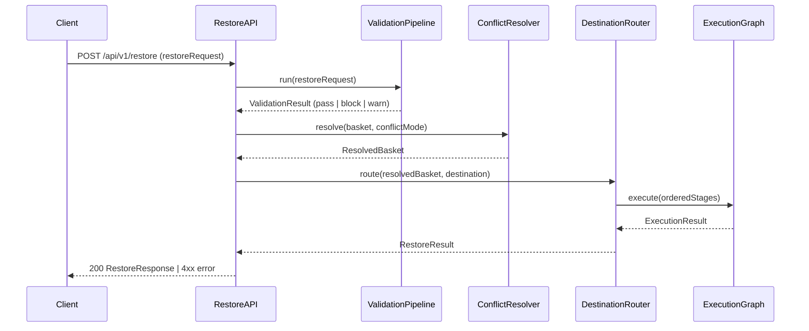
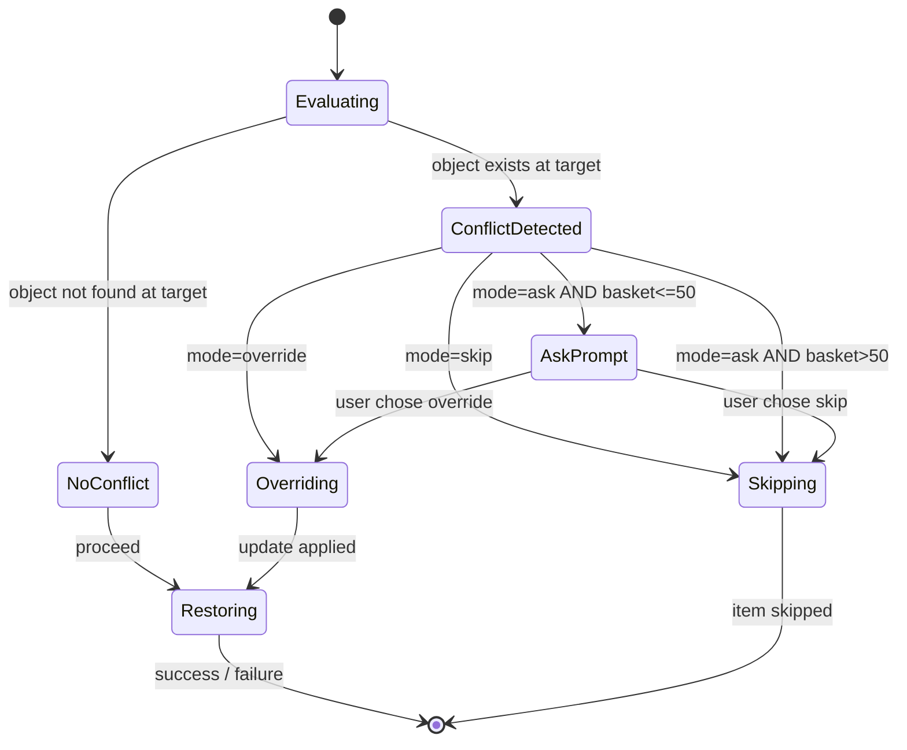
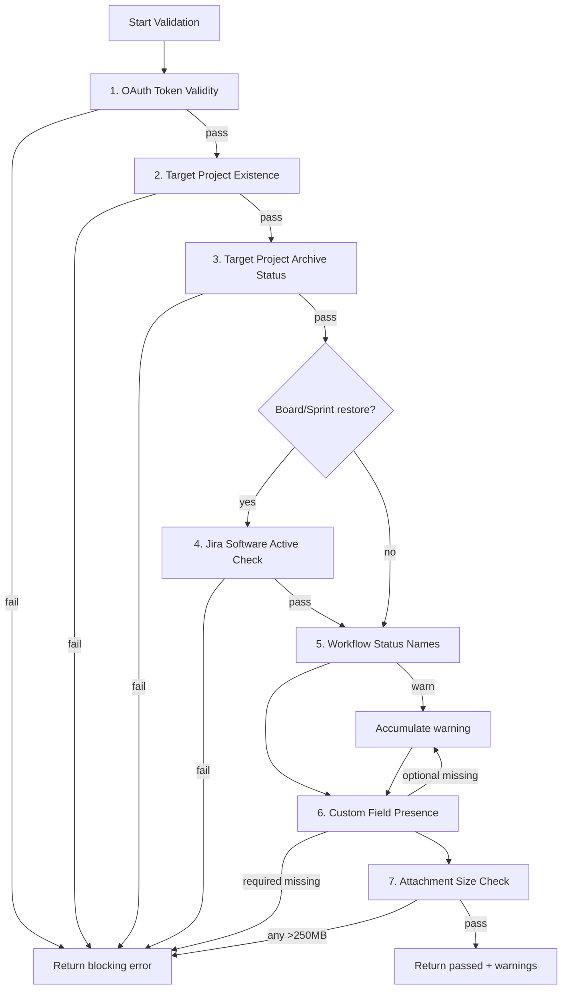

# Restore Engine Architecture

_Sprint 4 — Phase: Restore Engine_
_Author: Software Architect | Date: 2026-04-30_

---

## Table of Contents

1. [Overview](#overview)
2. [Dependency-Ordered Execution Graph](#dependency-ordered-execution-graph)
3. [Conflict Mode State Machine](#conflict-mode-state-machine)
4. [Restore Destination Router](#restore-destination-router)
5. [Cross-Site Custom Field ID Mapping](#cross-site-custom-field-id-mapping)
6. [Pre-Execution Validation Pipeline](#pre-execution-validation-pipeline)
7. [Permanent API Constraint Handlers](#permanent-api-constraint-handlers)
8. [API Contracts](#api-contracts)
9. [ADR: Architecture Decision Record](#adr-architecture-decision-record)

---

## Overview

The Restore Engine executes point-in-time restores of Jira objects from a backup point to a target destination. It must handle dependency ordering, conflict resolution, destination routing, and multiple permanent Jira API constraints.

### High-Level Flow



---

## Dependency-Ordered Execution Graph

### Stage Definitions

| Stage | Objects | Depends On |
|-------|---------|------------|
| 1 | Workflows, CustomFieldDefinitions | — |
| 2 | Projects | Stage 1 (field defs must exist before project screens) |
| 3 | Parent Issues | Stage 2 (project must exist) |
| 4 | Comments, Attachments, Boards | Stage 3 (parent issues must exist for comments/attachments; project for boards) |
| 5 | Sprints | Stage 4 (boards must exist) |

### Inter-Stage Dependency Resolution Rules

1. **Strict sequential gating**: Stage N+1 does not begin until all items in Stage N have either succeeded, been skipped (Skip mode), or been overridden (Override mode). A blocking failure in Stage N halts all subsequent stages.
2. **Intra-stage parallelism**: Objects within the same stage may be restored concurrently; no intra-stage ordering is enforced unless an explicit parent–child relationship exists within that stage (e.g., a sub-task issue referencing a parent issue within Stage 3 must restore the parent first).
3. **Custom field pre-flight**: Before Stage 1 executes, the cross-site custom field mapping step (if destination is cross-site) must complete without blocking errors. If blocked, the entire restore is aborted.
4. **Workflow definition supply**: Stage 1 workflow restore always supplies the full workflow JSON payload; partial/property-level updates are permanently excluded.
5. **Board→Sprint link**: Sprint objects in Stage 5 carry a `boardId` reference resolved from the Stage 4 board restore result map. If a board failed to restore in Stage 4, its dependent sprints are automatically skipped with reason `DEPENDENCY_MISSING`.

### Execution Graph Data Model

```typescript
interface ExecutionGraph {
  stages: ExecutionStage[];
  stageResultMap: Map<StageNumber, StageResult>;
}

interface ExecutionStage {
  stageNumber: 1 | 2 | 3 | 4 | 5;
  items: RestoreItem[];
  status: 'pending' | 'running' | 'complete' | 'blocked';
}

interface RestoreItem {
  id: string;                     // backup object ID
  objectType: JiraObjectType;
  dependsOn?: string[];           // IDs of items in previous stages this item needs
  resolvedTargetId?: string;      // populated after successful restore
  status: ItemStatus;
  skipReason?: string;
}

type ItemStatus = 'pending' | 'success' | 'skipped' | 'failed' | 'blocked';

type StageNumber = 1 | 2 | 3 | 4 | 5;

interface StageResult {
  stageNumber: StageNumber;
  succeeded: number;
  skipped: number;
  failed: number;
  blocked: number;
  items: RestoreItemResult[];
}

interface RestoreItemResult {
  id: string;
  objectType: JiraObjectType;
  status: ItemStatus;
  targetId?: string;              // Jira ID of the restored object
  skipReason?: string;
  errorCode?: string;
  errorDetail?: string;
}

type JiraObjectType =
  | 'workflow'
  | 'customFieldDefinition'
  | 'customFieldContext'
  | 'project'
  | 'issue'
  | 'comment'
  | 'attachment'
  | 'board'
  | 'sprint';
```

---

## Conflict Mode State Machine

### Modes

| Mode | Behaviour | Default |
|------|-----------|---------|
| `skip` | If object already exists at target, skip restore for this item. | ✅ Yes |
| `override` | If object already exists at target, update it before restoring dependents. Overrides are applied before any dependent objects in the same or later stages are processed. | No |
| `ask` | Pause and emit a per-conflict prompt to the caller for each conflict encountered. Suppressed (falls back to `skip`) when basket size > 50 items. | No |

### State Machine



### Rules

- **`skip` (default)**: Conflict resolution is non-destructive. Existing target object is left unchanged; the restore item status is set to `skipped` with reason `CONFLICT_SKIPPED`.
- **`override`**: The target object is updated via the appropriate Jira PUT/POST API before any dependent objects are processed. If the update fails, the item status is `failed` and dependents are `blocked`.
- **`ask` suppression**: When `basket.totalItems > 50`, the `ask` mode is silently downgraded to `skip`. This is enforced server-side regardless of the client request. The response includes `conflictModeEffective: 'skip'` and `conflictModeDowngradeReason: 'BASKET_SIZE_EXCEEDED'`.
- **Merge excluded**: The `merge` conflict mode is permanently excluded from the restore engine. Any request specifying `conflictMode: 'merge'` returns `400 INVALID_CONFLICT_MODE`.

### Data Model

```typescript
type ConflictMode = 'skip' | 'override' | 'ask';

interface ConflictResolutionRequest {
  conflictMode: ConflictMode;
  basketTotalItems: number;
}

interface ConflictResolutionResult {
  conflictModeEffective: 'skip' | 'override' | 'ask';
  conflictModeDowngradeReason?: 'BASKET_SIZE_EXCEEDED';
  perItemDecisions: ConflictDecision[];
}

interface ConflictDecision {
  itemId: string;
  decision: 'skip' | 'override' | 'ask_pending';
  conflictReason?: string;
}
```

---

## Restore Destination Router

### Destination Types

| Destination | Key | Description |
|-------------|-----|-------------|
| Original Location | `original` | Restore to the same Jira site and project identified by matching project key and object name |
| Alternate Location | `alternate` | Restore to a different project or cross-site target specified by the caller |
| JSON + ZIP Export | `export` | Serialize restored objects to JSON; bundle attachment binaries into a ZIP file for download |

### Router Interface

```typescript
type RestoreDestinationType = 'original' | 'alternate' | 'export';

interface RestoreDestination {
  type: RestoreDestinationType;
  // Populated for 'original' destination:
  originalSiteId?: string;
  originalProjectKey?: string;
  // Populated for 'alternate' destination:
  targetSiteId?: string;         // may differ from source site (cross-site)
  targetProjectKey?: string;
  isCrossSite?: boolean;         // true when targetSiteId !== sourceSiteId
  // Populated for 'export' destination:
  exportFormat?: 'json' | 'json+zip';
}

interface DestinationRouterInput {
  destination: RestoreDestination;
  resolvedBasket: ResolvedBasket;
  customFieldMapping?: CustomFieldMapping; // required when isCrossSite=true
}

interface DestinationRouterOutput {
  routedItems: RoutedItem[];
  exportManifest?: ExportManifest;  // only for export destination
}

interface RoutedItem {
  itemId: string;
  targetSiteId: string;
  targetProjectKey: string;
  targetApiBase: string;  // e.g. https://api.atlassian.com/ex/jira/{cloudId}
}
```

### Routing Rules

1. **Original location match**: The router resolves the target using `projectKey` (exact match) and object name (exact match for workflows, custom field definitions). If no match is found, the item is marked `failed` with `ORIGINAL_TARGET_NOT_FOUND`.
2. **Alternate/cross-site gate**: When `isCrossSite=true`, the custom field ID mapping step **must** complete before routing begins. If the mapping step returns a blocking error, routing is aborted for all affected items.
3. **Export destination**: No Jira API calls are made. The router serialises each object into a JSON document. Attachment binaries are fetched from the backup store and streamed into a ZIP archive. The export manifest lists all included objects and the ZIP entry path for each attachment.

---

## Cross-Site Custom Field ID Mapping

### Purpose

Jira custom field IDs are site-scoped. A field with ID `customfield_10001` on site A may map to `customfield_10099` on site B, or may not exist at all. Cross-site restores require a mapping step that translates source field IDs to target field IDs before any issue restore begins.

### Step Interface

```typescript
interface CustomFieldMappingInput {
  sourceSiteId: string;
  targetSiteId: string;
  sourceFieldIds: string[];           // e.g. ['customfield_10001', 'customfield_10002']
}

interface CustomFieldMappingOutput {
  fieldMap: Record<string, string>;   // sourceFieldId → targetFieldId
  missingRequired: string[];          // required fields absent on target site
  missingOptional: string[];          // optional fields absent on target site
  status: 'ok' | 'blocked' | 'warn';
}
```

### Mapping Resolution Algorithm

1. Call `GET /rest/api/3/field` on the target site to retrieve all field definitions.
2. Match source fields by `name` (case-insensitive) against target fields.
3. Populate `fieldMap` with matches found.
4. For each source field with no match:
   - If the field is **required** (i.e., present in the target project's mandatory field configuration): add to `missingRequired`.
   - Otherwise: add to `missingOptional`.
5. Set `status`:
   - `blocked` if `missingRequired.length > 0`
   - `warn` if `missingRequired.length === 0 && missingOptional.length > 0`
   - `ok` otherwise

### Blocking Behaviour

- `status: 'blocked'` → restore is aborted. Response: `409 CUSTOM_FIELD_MAPPING_BLOCKED` with `missingRequired` list.
- `status: 'warn'` → restore proceeds; optional fields are dropped from restored issues. Warning is surfaced in `RestoreResponse.warnings`.
- `status: 'ok'` → proceed normally.

---

## Pre-Execution Validation Pipeline

Validation runs in the order defined below. The pipeline halts on the first **blocking** failure and returns the result immediately. Non-blocking checks accumulate warnings and continue.

### Validation Checks

| # | Check | Classification | Error Code |
|---|-------|---------------|------------|
| 1 | OAuth token validity — target site access token is valid and not expired | **Blocking** | `OAUTH_TOKEN_INVALID` |
| 2 | Target project existence — project key exists on target site | **Blocking** | `TARGET_PROJECT_NOT_FOUND` |
| 3 | Target project archive status — project is not archived | **Blocking** | `TARGET_PROJECT_ARCHIVED` |
| 4 | Jira Software active on target — required only for Board/Sprint restores | **Blocking** (Board/Sprint only) | `JIRA_SOFTWARE_NOT_ACTIVE` |
| 5 | Workflow status names present — all statuses referenced in workflow exist on target | **Non-blocking** (warn) | `WORKFLOW_STATUS_NAME_MISSING` |
| 6 | Custom field definitions present — required fields must exist; optional fields emit warn | **Blocking** (required) / **Non-blocking** (optional) | `CUSTOM_FIELD_REQUIRED_MISSING` / `CUSTOM_FIELD_OPTIONAL_MISSING` |
| 7 | Attachment size ≤ 250 MB — per attachment | **Blocking** (per attachment) | `ATTACHMENT_SIZE_EXCEEDED` |

### Validation Pipeline Data Model

```typescript
interface ValidationPipelineInput {
  restoreRequest: RestoreRequest;
  targetSiteId: string;
  targetProjectKey: string;
  basketItems: RestoreItem[];
  includeBoardSprintRestore: boolean;
}

interface ValidationPipelineResult {
  passed: boolean;
  blockingError?: ValidationCheckResult;
  warnings: ValidationCheckResult[];
}

interface ValidationCheckResult {
  checkId: 1 | 2 | 3 | 4 | 5 | 6 | 7;
  checkName: string;
  passed: boolean;
  blocking: boolean;
  errorCode?: string;
  detail?: string;
  affectedItems?: string[];         // IDs of affected restore items
}
```

### Pipeline Sequence



---

## Permanent API Constraint Handlers

These handlers are always applied; they cannot be disabled by configuration.

### 1. Issue Key Label Stamping

**Purpose**: Preserve the original Jira issue key after restore, since Jira assigns a new key on creation.

**Behaviour**:
- Before calling the Jira issue creation API, inject the label `original-key:{originalKey}` (e.g. `original-key:PROJ-123`) into the `labels` array of the create payload.
- If the issue already has a `labels` array, append to it; do not overwrite.
- The label is always applied; there is no opt-out.

**Handler Interface**:
```typescript
function stampOriginalKeyLabel(
  payload: JiraIssueCreatePayload,
  originalKey: string
): JiraIssueCreatePayload;
// Mutates payload.fields.labels in-place (or creates it).
// Returns the modified payload.
```

### 2. Reporter Attribution Header

**Purpose**: Preserve the original reporter identity in the restored issue comment body, since Jira Cloud does not allow setting the `reporter` field to an arbitrary user via API.

**Behaviour**:
- When restoring a **comment**, prepend the following header line to the comment body text (plain text ADF paragraph):
  ```
  [Restored from backup — original reporter: {displayName} <{emailAddress}>]
  ```
- This header is the **first line** of the restored comment body.
- The original comment content follows after a blank line.

**Handler Interface**:
```typescript
function injectReporterAttributionHeader(
  commentBody: AdfDocument,
  originalReporter: { displayName: string; emailAddress: string }
): AdfDocument;
// Prepends an ADF paragraph node with the attribution text.
```

### 3. Comment Author ADF Header

**Purpose**: Preserve the original comment author identity, since restored comments are authored by the OAuth service account.

**Behaviour**:
- Prepend an inline ADF paragraph node as the **first node** in the comment body ADF document:
  ```
  [Original comment by: {authorDisplayName} on {originalCreatedDate ISO 8601}]
  ```
- This node is always present in restored comments.
- If both reporter attribution (handler 2) and comment author attribution (handler 3) apply, the comment author ADF header is prepended **before** the reporter attribution header.

**Handler Interface**:
```typescript
function prependCommentAuthorAdfHeader(
  adfDoc: AdfDocument,
  author: { displayName: string; accountId: string },
  originalCreatedDate: string   // ISO 8601
): AdfDocument;
// Returns new AdfDocument with author header paragraph prepended.
```

### 4. Full Workflow Definition Supply

**Purpose**: Jira's workflow create/update API requires the complete workflow JSON. Partial/property-level updates are not supported.

**Behaviour**:
- When restoring a workflow (Stage 1), always fetch the full workflow definition from the backup store and supply it as the complete payload to `POST /rest/api/3/workflow` or `PUT /rest/api/3/workflow/{workflowId}`.
- No partial update path exists; property-level workflow patching is permanently excluded.
- If the backup store does not contain a full workflow definition for an item, the item is marked `failed` with `WORKFLOW_DEFINITION_MISSING`.

**Handler Interface**:
```typescript
function buildWorkflowRestorePayload(
  backupWorkflow: JiraWorkflowNode
): WorkflowCreatePayload;
// Constructs the full Jira workflow create/update payload from the backup node.
// Throws WORKFLOW_DEFINITION_MISSING if backupWorkflow.definition is absent.
```

---

## API Contracts

### Base Path

All restore endpoints are mounted at `/api/v1/restore`.

---

### POST /api/v1/restore — Initiate Restore

**Request**

```typescript
interface RestoreRequest {
  backupPointId: string;           // ID of the backup point to restore from
  sourceSiteId: string;
  destination: RestoreDestination; // see Destination Router section
  conflictMode?: ConflictMode;     // default: 'skip'
  objectSelection: ObjectSelection;
}

interface ObjectSelection {
  includeAll: boolean;
  objectTypes?: JiraObjectType[];  // if includeAll=false, explicit list
  projectKeys?: string[];          // filter to specific projects
  issueKeys?: string[];            // filter to specific issues
}
```

**Success Response — 200**

```typescript
interface RestoreResponse {
  restoreJobId: string;
  status: 'queued' | 'running' | 'complete' | 'failed';
  conflictModeEffective: ConflictMode;
  conflictModeDowngradeReason?: 'BASKET_SIZE_EXCEEDED';
  destination: RestoreDestination;
  validationWarnings: ValidationCheckResult[];
  stageResults?: StageResult[];    // populated when status='complete'|'failed'
  exportDownloadUrl?: string;      // populated for export destination on completion
}
```

**Error Responses**

| HTTP | Error Code | Condition |
|------|-----------|-----------|
| 400 | `INVALID_CONFLICT_MODE` | `conflictMode: 'merge'` specified |
| 400 | `MISSING_BACKUP_POINT` | `backupPointId` not found |
| 409 | `OAUTH_TOKEN_INVALID` | Check 1 failed |
| 409 | `TARGET_PROJECT_NOT_FOUND` | Check 2 failed |
| 409 | `TARGET_PROJECT_ARCHIVED` | Check 3 failed |
| 409 | `JIRA_SOFTWARE_NOT_ACTIVE` | Check 4 failed |
| 409 | `CUSTOM_FIELD_MAPPING_BLOCKED` | Cross-site required field absent |
| 409 | `ATTACHMENT_SIZE_EXCEEDED` | Check 7 failed — includes `affectedAttachmentIds` |

---

### GET /api/v1/restore/:restoreJobId — Poll Job Status

**Success Response — 200**

```typescript
interface RestoreJobStatusResponse {
  restoreJobId: string;
  status: 'queued' | 'running' | 'complete' | 'failed';
  currentStage?: StageNumber;
  stageResults: StageResult[];
  validationWarnings: ValidationCheckResult[];
  exportDownloadUrl?: string;
}
```

**Error Response**

| HTTP | Error Code | Condition |
|------|-----------|-----------|
| 404 | `RESTORE_JOB_NOT_FOUND` | Job ID does not exist |

---

### POST /api/v1/restore/:restoreJobId/conflict-decision — Submit Ask Decision

Used only when `conflictModeEffective: 'ask'` and a per-conflict prompt is pending.

**Request**

```typescript
interface ConflictDecisionRequest {
  itemId: string;
  decision: 'skip' | 'override';
}
```

**Success Response — 200**

```typescript
interface ConflictDecisionResponse {
  itemId: string;
  decision: 'skip' | 'override';
  restoreJobStatus: 'running' | 'complete' | 'failed';
}
```

**Error Responses**

| HTTP | Error Code | Condition |
|------|-----------|-----------|
| 404 | `RESTORE_JOB_NOT_FOUND` | Job not found |
| 409 | `NO_PENDING_CONFLICT` | No conflict awaiting decision for this item |
| 409 | `ASK_MODE_SUPPRESSED` | Basket >50; ask mode was downgraded to skip |

---

### POST /api/v1/restore/validate — Dry-Run Validation Only

Run the pre-execution validation pipeline without starting a restore.

**Request**: Same shape as `RestoreRequest`.

**Success Response — 200**

```typescript
interface ValidationOnlyResponse {
  passed: boolean;
  blockingError?: ValidationCheckResult;
  warnings: ValidationCheckResult[];
  customFieldMapping?: CustomFieldMappingOutput;  // populated for cross-site
  basketSummary: {
    totalItems: number;
    byType: Record<JiraObjectType, number>;
    conflictModeEffective: ConflictMode;
    conflictModeDowngradeReason?: 'BASKET_SIZE_EXCEEDED';
  };
}
```

---

### GET /api/v1/restore/:restoreJobId/export — Download Export Archive

Only valid for `destination.type: 'export'` restores after completion.

**Success Response — 200**
- Content-Type: `application/zip`
- Body: ZIP archive containing:
  - `manifest.json` — object list with paths
  - `objects/*.json` — per-object JSON files
  - `attachments/*` — attachment binaries

**Error Responses**

| HTTP | Error Code | Condition |
|------|-----------|-----------|
| 404 | `RESTORE_JOB_NOT_FOUND` | Job not found |
| 409 | `EXPORT_NOT_READY` | Job not yet complete |
| 409 | `NOT_EXPORT_DESTINATION` | Job is not an export-type restore |

---

## ADR: Architecture Decision Record

### ADR-001: Merge Mode Permanently Excluded

**Status**: Accepted

**Context**: Jira objects (issues, workflows) have complex nested structures where a field-level merge would require deep schema knowledge per object type and could silently overwrite data. The risk of data corruption from partial merges outweighs the convenience.

**Decision**: The `merge` conflict mode is permanently excluded. Any request specifying it is rejected with `400 INVALID_CONFLICT_MODE`. This is a hard constraint, not a configuration option.

**Consequences**: Users who need merge-like behaviour must use `override` or `ask` mode with manual review.

---

### ADR-002: Ask Mode Basket Limit of 50

**Status**: Accepted

**Context**: The `ask` conflict mode requires a synchronous per-item decision from the user. For large baskets, this creates unacceptable UX latency and increases the risk of user error.

**Decision**: When `basketTotalItems > 50`, `ask` mode is silently downgraded to `skip` server-side. The effective mode and downgrade reason are always returned in the response.

**Consequences**: For baskets > 50 items, users must explicitly choose `override` if they want non-skip conflict behaviour. This is a deliberate conservative default.

---

### ADR-003: Full Workflow Definition Required

**Status**: Accepted

**Context**: The Jira workflow API (`POST /rest/api/3/workflow`) requires the complete workflow definition including all statuses, transitions, and properties. There is no PATCH endpoint for workflows.

**Decision**: The restore engine always supplies the full workflow definition from the backup store. If the backup store lacks a complete definition, the restore item fails rather than attempting a partial restore that would corrupt the workflow.

**Consequences**: Backup completeness requirements are higher — the backup engine must always capture full workflow definitions, not just diffs.

---

### ADR-004: Comment Attribution via ADF Header (not API field)

**Status**: Accepted

**Context**: Jira Cloud's comment API does not support setting the `author` field to an arbitrary user. Comments created via API are always attributed to the OAuth service account.

**Decision**: Original author and reporter identity is preserved by prepending structured ADF paragraph nodes to the comment body. The comment author header is prepended first (outermost), followed by the reporter attribution header.

**Consequences**: Restored comments visually show attribution text in the body. Programmatic consumers of comment bodies must be aware of and strip these header paragraphs if needed.

---

### ADR-005: Cross-Site Custom Field Mapping is a Blocking Gate

**Status**: Accepted

**Context**: Custom field IDs are site-scoped. Restoring issues without mapping field IDs would silently write data to wrong fields or fail with API errors.

**Decision**: For cross-site restores, the custom field mapping step is a mandatory pre-execution gate. Missing required fields block the entire restore; missing optional fields emit warnings and proceed with those fields dropped.

**Consequences**: Cross-site restores require that the target site have equivalent custom field names. Name-based matching is the resolution strategy; ID-based matching is not possible across sites.
