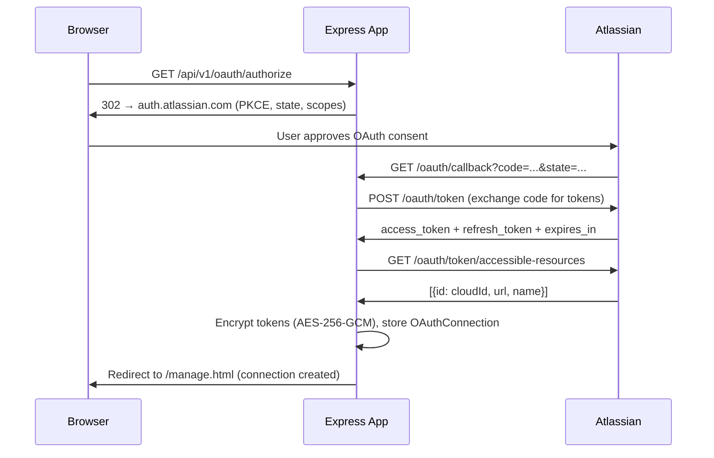
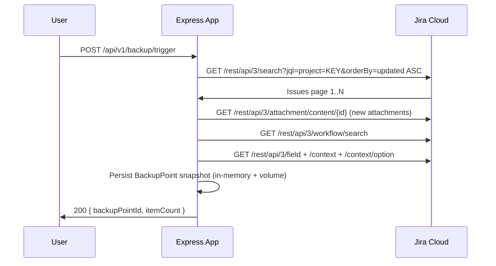

# System Architecture Overview

## What is jira_workload?

jira_workload is a self-hosted Node.js platform that connects to Jira Cloud via
Atlassian OAuth 2.0 and provides backup, browse, restore, sensitive-data
intelligence, and resilience capabilities for your Jira data.

This document gives a plain-language tour of how the major parts fit together.

---

## High-Level Component Diagram

```
┌──────────────────────────────────────────────────────────────────────────┐
│                        User's browser                                    │
│  connect.html  manage.html  browse.html  sdi.html  resilience.html ...   │
└──────────────────────────────┬───────────────────────────────────────────┘
                               │  HTTP / REST (port 4000)
┌──────────────────────────────▼───────────────────────────────────────────┐
│                   Express Application  (src/app.js)                      │
│                                                                          │
│  /api/v1/oauth        OAuth 2.0 (3LO) token exchange & site selection   │
│  /api/v1/integrations Integration lifecycle (create / soft-delete)      │
│  /api/v1/backup       Backup trigger & policy management                │
│  /api/v1/search       Global, project, issue, attachment, board search  │
│  /api/v1/backup-points Backup point metadata & Object Explorer          │
│  /api/v1/restore      Point-in-time restore pipeline                    │
│  /api/v1/sdi          Sensitive Data Intelligence scan & results        │
│  /api/v1/resilience   Protected Object Inventory                        │
│  /health              Liveness probe                                    │
└────────┬──────────────────────────────────────────────────────┬──────────┘
         │                                                       │
┌────────▼─────────────┐                             ┌──────────▼──────────┐
│  In-memory data store│                             │  Atlassian Jira     │
│  (src/db/index.js)   │                             │  Cloud REST API     │
│                      │                             │  (api.atlassian.com)│
│  OAuthConnections    │                             │                     │
│  CloudSites          │                             │  /rest/api/3/...    │
│  BackupPoints        │                             │  /oauth/token/...   │
│  SdiScanResults      │                             │  /rest/agile/1.0/.. │
│  RestoreJobs         │                             └─────────────────────┘
└──────────────────────┘
         │
┌────────▼─────────────┐
│  Local file system   │
│  (Podman volumes)    │
│                      │
│  data/backups/       │  ← backup JSON + attachment binaries
│  data/sdi-tmp/       │  ← temporary SDI extraction files
│  data/exports/       │  ← JSON + ZIP restore exports
└──────────────────────┘
```

---

## Request Flow: OAuth Connection



Key security properties:
- PKCE (`S256`) prevents authorization code interception.
- Tokens are encrypted at rest with a per-deployment AES-256-GCM key (`OAUTH_TOKEN_ENCRYPTION_KEY`).
- Tokens are never logged or returned to the browser.
- `read:board-scope:jira-software` is optional; its absence degrades board/sprint features gracefully.

---

## Request Flow: Backup



Subsequent backup runs use an incremental JQL cursor (`updated >= lastBackupTimestamp`)
and only download new or changed attachment binaries (unchanged ones are carried forward
by sidecar reference).

Real-time delta events arrive via Atlassian webhooks (`issue_created`, `issue_updated`,
`issue_deleted`) registered dynamically at connect time.

---

## Request Flow: Restore

The restore pipeline executes in dependency order:

```
Stage 1: Workflows + Custom Field Definitions
Stage 2: Projects
Stage 3: Parent Issues
Stage 4: Comments + Attachments + Boards
Stage 5: Sprints
```

Each stage applies one of three conflict modes:

| Mode | Behaviour |
|---|---|
| **Skip** (default) | Leave existing objects untouched; skip conflicting items |
| **Override** | Overwrite existing objects with backup data |
| **Ask** | Prompt user per conflict (suppressed to Skip when basket > 50 items) |

Cross-site restores include an additional custom field ID mapping step: required
fields without a mapping block the restore; optional fields are skipped with a warning.

Permanent API constraint handlers ensure:
- Issue keys are stamped as labels (`original-key:PROJ-123`) since Jira does not allow
  replaying arbitrary keys.
- Reporter and comment author attribution is preserved via ADF header prepend (Jira
  Cloud does not expose these fields for write).

---

## Request Flow: Sensitive Data Intelligence (SDI)

```
Backup storage
     │
     ▼
File Enumerator  →  selects .json .xml .csv .pdf .docx .txt .md .yaml .env .properties .toml
     │
     ▼
File Extractor   →  text files: direct read; .pdf: pdf-parse; .docx: OOXML unzip (≤ 50 MB)
     │
     ▼
Pattern Scanner  →  regex patterns for Email, Credential/API Key, Credit Card (PAN + Luhn), Phone
     │
     ▼
Findings Aggregator  →  per (backupPointId × fileType × dataElementType) counts only
     │                   raw match strings are NEVER stored or returned
     ▼
Regulation Mapper →  Active: GDPR, CCPA, PCI DSS
                      Shown:  DORA, NIS2, SOC 2
                      Excluded: HIPAA
     │
     ▼
Results API  →  GET /api/v1/sdi/results/:backupPointId
```

---

## Request Flow: Resilience Module

The Resilience Module surfaces a Protected Object Inventory — a read-only view
of the three object types that are permanently excluded from purge cascades:

| Sidebar item | Node type | Purge-protected |
|---|---|---|
| Projects | `JiraProjectNode` | No (can be purged) |
| Workflows | `JiraWorkflowNode` | **Yes** |
| Custom Fields | `JiraCustomFieldNode` | **Yes** |

The purge cascade boundary is enforced at the **service layer** (`src/services/purgeCascade.js`)
regardless of what the UI sends. The lock icon displayed in the sidebar is informational only.

---

## Deployment Architecture (Podman)

```
Host machine (macOS / Linux / Windows WSL2)
│
└── Podman (rootless, no daemon)
    │
    └── Container: jira-workload:latest
        │   Base image: node:20-alpine
        │   PID 1:      dumb-init
        │   User:       nodeapp (UID 1001, non-root)
        │   Port:       4000
        │
        ├── Volume: backup_data  → /app/data/backups
        ├── Volume: sdi_tmp      → /app/data/sdi-tmp
        └── Volume: export_data  → /app/data/exports
```

The container is started via `podman-compose -f podman-compose.yml up --build`.
Platform-specific startup scripts (`start.sh`, `start.ps1`, `start.bat`) handle:
- Podman / podman-compose availability checks
- macOS: `podman machine` VM state validation
- Linux: `DOCKER_HOST` socket export for rootless compatibility
- Windows: native Podman Desktop detection with WSL2 fallback
- `.env` bootstrap from `.env.example` on first run
- Health-check polling loop after startup

Named volumes persist across container restarts. Removing them (`down -v`) permanently
deletes all backup data.

---

## Technology Stack

| Layer | Technology |
|---|---|
| Runtime | Node.js 20 (LTS) |
| HTTP framework | Express 4 |
| Container runtime | Podman 4+ (rootless) |
| Compose tool | podman-compose 1+ |
| Base image | node:20-alpine |
| Token encryption | AES-256-GCM (Node.js `crypto`) |
| Data store | In-memory (`src/db/index.js`); production DB via `DATABASE_URL` |
| Type sharing | TypeScript interfaces in `packages/shared-types/` |
| Testing | Jest + Supertest |

---

## Architecture Decision Records

Detailed sprint-level ADRs live in this directory:

| Document | Coverage |
|---|---|
| [oauth-architecture.md](oauth-architecture.md) | OAuth 2.0 3LO, scope matrix, token storage, multi-site |
| [backup-discovery-pipeline.md](backup-discovery-pipeline.md) | JQL enumeration, incremental cursor, webhooks, attachments |
| [browse-search-object-explorer-architecture.md](browse-search-object-explorer-architecture.md) | Search API design, Object Explorer change indicators |
| [restore-engine-architecture.md](restore-engine-architecture.md) | Restore pipeline, conflict modes, API constraint handlers |
| [sdi-architecture.md](sdi-architecture.md) | SDI scan pipeline, detection patterns, regulation mapping |
| [resilience-module-architecture.md](resilience-module-architecture.md) | Protected Object Inventory, purge cascade boundary |
